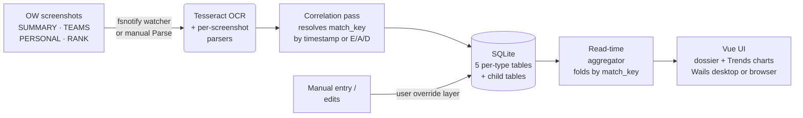

# Architecture

How Recall turns Overwatch screenshots — or hand-entered matches — into a
queryable, local match history. This is the technical/internals view; for the
player-facing "how do I use it" walkthrough see
[docs/how-it-works.md](https://sound-barrier.github.io/recall/how-it-works.html),
and for contributor conventions see [CONTRIBUTING.md](CONTRIBUTING.md) and
[CLAUDE.md](CLAUDE.md).

## Pipeline

1. **Capture** — a folder watcher (`fsnotify`) or a manual *Parse* run feeds new
   `.png`/`.jpg` screenshots into the pipeline. Recall recognises the
   Nvidia Overlay / OW PrntScn / Windows Snip / Steam filename shapes by their
   embedded timestamps.
2. **OCR + parse** — each screenshot is read by the **Tesseract** CLI (shelled
   out) and dispatched to a per-screenshot-type parser (SUMMARY / TEAMS /
   PERSONAL / RANK), producing a `MatchResult`.
3. **Correlation** — `resolveMatchKey` stitches the screenshots of one game
   together by either a filename-timestamp window or a matching
   eliminations/assists/deaths signature.
4. **Storage (SQLite is the source of truth)** — five per-type **parent** tables
   plus **child** tables for repeating groups (heroes played, per-hero stats,
   rank SR/modifiers). Raw per-screenshot rows are preserved verbatim; nothing is
   folded or derived on write, so a wrong scalar from one screenshot can be
   corrected later by adding another.
5. **User override layer** — edits to a parsed match *and* fully hand-entered
   matches live in a separate per-`match_key` layer (`user_match_data` + its
   children), grafted onto the OCR data at read time. Resetting a match just
   deletes the override row, restoring the original parse; a manual match is one
   that lives **only** in this layer with no screenshot rows.
6. **Read-time aggregation** — `aggregateAll` bulk-loads every table once, groups
   by `match_key`, and folds each group into one `MatchRecord`
   (first-non-empty-wins). Derived fields like `role` (from hero) and map `type`
   are computed on the fly from the shipped reference data — **never stored** (a
   3NF discipline, so a reference-data update can't leave a stale derived value).
7. **Surfaces** — the same aggregator feeds the Vue UI (Wails desktop window or
   the headless server-mode browser app): a filterable dossier plus a **Trends**
   section of in-app time-series charts (SR, win-rate, per-match stats, per-10).

## Stack

- **Backend:** Go — **pure-Go, no CGo** (`modernc.org/sqlite`), so release builds
  cross-compile cleanly for every platform.
- **Frontend:** Vue 3 + Vite, embedded in a [Wails v2](https://wails.io/) desktop
  shell or served as a static SPA in server mode.
- **OCR:** the [Tesseract](https://github.com/tesseract-ocr/tesseract) 5.x CLI,
  invoked per screenshot.
- **Charts:** in-app time-series via [ECharts](https://echarts.apache.org/)
  (tree-shaken, lazy-loaded), rendered in the Matches → Trends section.

## Where data lives

Per-profile SQLite databases under the platform config dir
(`~/Library/Application Support/Recall/`, `~/.config/recall/`, or
`%AppData%\Recall\`) — see
[How it works → Where things live on disk](https://sound-barrier.github.io/recall/how-it-works.html#where-things-live-on-disk).
There is no account and no network upload; the only outbound calls are the
opt-in "Check for updates" button and the optional reference-data refresh.

## Going deeper

The `.claude/rules/*.md` files and [CLAUDE.md](CLAUDE.md) document the write/read
paths, the schema, the parser, the metrics boundary, and the API contract in
detail. The HTTP API is described by
[`api/openapi.yaml`](api/openapi.yaml) and rendered as
[Swagger UI](https://sound-barrier.github.io/recall/api/).
