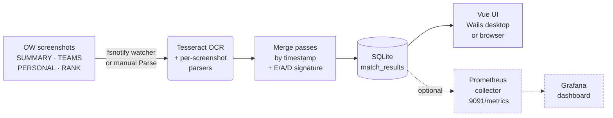

# Recall

[](https://github.com/sound-barrier/recall/actions/workflows/ci.yml)
[](https://github.com/sound-barrier/recall/actions/workflows/release.yml)
[](https://github.com/sound-barrier/recall/actions/workflows/codeql.yml)
[](https://github.com/sound-barrier/recall/releases/latest)
[](LICENSE)
[](https://go.dev/)

**Recall** is a desktop app for Overwatch players who want to understand
their performance trends over time. It watches a folder of OW post-match
screenshots, reads them with Tesseract OCR, and stores per-match data in a
local database. Optionally it exposes the match history as Prometheus metrics
so a bundled Grafana dashboard can chart win rates, SR trends, and per-hero stats.



## Table of Contents

**Getting started**

- [Quick start](#quick-start)
- [Installation](#installation)
  - [macOS first launch](#macos-first-launch)
  - [Linux installation](#linux-installation)
  - [Verifying downloads](#verifying-downloads)
- [Prerequisites](#prerequisites)
- [Capturing matches](#capturing-matches)

**Advanced** — most users can skip these

- [🖥️ Use without the desktop app](docs/server.md) — browser access, headless mode, run on startup
- [🐳 Run in Docker](docs/docker.md) — containers, home lab, NAS
- [📊 Charts & Dashboards](docs/grafana.md) — Grafana, SR over time, win-rate charts

**Project**

- [Contributing](#contributing)
- [License](#license)

## Quick start

The desktop app is the simplest way to use Recall. Five steps from zero to your first match record:

1. **Install Recall** — grab the `.dmg` (macOS), `.deb` / `.tar.gz` (Linux), or `.exe` (Windows) from [GitHub Releases](https://github.com/sound-barrier/recall/releases). See [Installation](#installation) for per-platform notes.
2. **Install Tesseract OCR 5.x** — Recall shells out to it to read your screenshots. Version 5.x is required; older versions trigger a caution warning and may produce incorrect results.
   - macOS: `brew install tesseract` (installs 5.x)
   - Linux: `sudo apt install tesseract-ocr` (Ubuntu 22.04+ ships 5.x; older distros may need a [PPA](https://launchpad.net/~alex-p/+archive/ubuntu/tesseract-ocr5))
   - Windows: [UB-Mannheim installer](https://github.com/UB-Mannheim/tesseract/wiki) (choose the 5.x series)
3. **Launch Recall and pick a screenshots folder** under **Settings → Directories**. On Windows, Overwatch's default is `Documents\Overwatch\ScreenShots\Overwatch\`.
4. **Capture screenshots in Overwatch** with **F12** after each match — see [Capturing matches](#capturing-matches) for which post-match tabs to screenshot.
5. **Click *Ingest → Run Parse*** to scan the folder, or flip on *Ingest → Parse → Watch Folder* to auto-parse as new screenshots land. Parsed matches appear under the **Matches** tab.

That's all most users need. The [Advanced](#advanced) sections below cover running Recall headless and streaming matches into a local Grafana dashboard — neither is required for everyday use.

## Installation

Pre-built binaries for every tagged release are on the [GitHub Releases](https://github.com/sound-barrier/recall/releases) page.

| Platform | Wails desktop app | Server binary |
|---|---|---|
| Linux | `recall-{version}-linux-amd64.tar.gz` · `recall-{version}-linux-amd64.deb` | `recall-server-{version}-linux-amd64.tar.gz` · `recall-server-{version}-linux-amd64.deb` |
| Windows | `recall-{version}-windows-amd64.exe` | `recall-server-{version}-windows-amd64.exe` |
| macOS arm64 | `recall-{version}-darwin-arm64.dmg` | `recall-server-{version}-darwin-arm64.tar.gz` |
| Docker | — | `ghcr.io/sound-barrier/recall-server:latest` |

### macOS first launch

The `.dmg` is not notarized (notarization requires an Apple Developer certificate). macOS will block the app on first open with a warning about unverified software. To bypass it, **right-click the app → Open**, then click **Open** in the dialog that appears. You only need to do this once; subsequent launches work normally.

Alternatively, from Terminal:
```sh
xattr -d com.apple.quarantine /Applications/Recall-arm64.app
```

Or go to **System Settings → Privacy & Security** and click **Open Anyway** after the first blocked launch.

### Linux installation

`.deb` packages install the binary to `/usr/local/bin/`:

```sh
sudo dpkg -i recall-{version}-linux-amd64.deb         # installs /usr/local/bin/recall
sudo dpkg -i recall-server-{version}-linux-amd64.deb  # installs /usr/local/bin/recall-server
```

### Verifying downloads

Every release binary and package ships with a companion `.sha256` file containing its SHA256 hash. Download both the artifact and its `.sha256` file, then verify:

```sh
# Linux / WSL
sha256sum --check recall-{version}-linux-amd64.tar.gz.sha256

# macOS
shasum -a 256 --check recall-{version}-darwin-arm64.dmg.sha256
```

`sha256sum` prints `OK` when the file matches what was built in CI; any mismatch prints `FAILED` and exits non-zero.

Every release also includes `recall-{version}-sbom.spdx.json` — a bill of materials listing every dependency the release was built from.

## Prerequisites

- **Tesseract OCR 5.x** — required for screenshot parsing. Only the 5.x series is officially supported; 3.x / 4.x binaries are detected and flagged with a caution warning (parsing may produce incorrect results). Install via Homebrew (`brew install tesseract`) on macOS, `apt install tesseract-ocr` on Linux (Ubuntu 22.04+ ships 5.x), or the [Windows installer](https://github.com/UB-Mannheim/tesseract/wiki) (choose the 5.x series). On first launch Recall auto-detects the standard install path; use **Ingest → Engine** to point it elsewhere if needed.

Settings and the match database are stored in the platform user-config directory:
- macOS: `~/Library/Application Support/Recall/`
- Linux: `~/.config/recall/`
- Windows: `%AppData%\Recall\`

## Capturing matches

Recall reads four kinds of post-match screenshots from Overwatch. Three are required for a complete match record; the fourth is optional but recommended for competitive play.

| Screenshot | Required? | What it provides |
|---|---|---|
| **SUMMARY** | ✅ Required | Match result (victory/defeat/draw), final score, map, mode, date, game length, and the list of heroes played with playtime percentages. |
| **TEAMS** (scoreboard) | ✅ Required | Eliminations, assists, deaths, damage, healing, mitigation. The in-game scoreboard (Tab key, mid-match) works as a fallback for the post-match tab. |
| **PERSONAL** | ✅ Required (one per hero played) | Per-hero detailed stats: weapon accuracy, ult charges, role-specific cards. If you played multiple heroes in a single match, take one PERSONAL screenshot for each. |
| **RANK** | ⭕ Optional (competitive only) | SR value, rank tier, rank change. Only appears after competitive matches. If it's missing but the SR change is captured, Recall infers the win/loss from the SR delta. |

The in-game screenshot key is **F12** by default (rebindable under *Options → Controls → General → Screenshot*). After a match ends, cycle through the post-match tabs and press F12 on each. Recall stitches the screenshots into a single match record using the filename timestamps Overwatch embeds — taking them within a couple of minutes of each other is enough.

Overwatch saves screenshots to `Documents\Overwatch\ScreenShots\Overwatch\` on Windows by default. Point Recall at that folder under **Settings → Directories**; the watcher (enabled under **Ingest → Parse → Watch Folder**) auto-parses any new `.png` / `.jpg` that lands in it.

**What if a screenshot type is missing?** Each match card has a *Data Coverage* strip in its expanded view that flags which of the four screenshot types were captured. Required-but-missing types are highlighted with a warning chip; the optional RANK is shown greyed out when absent. Screenshots Recall couldn't match to a known map collect in the **Unknown** tab for triage.

---

# Advanced

If you're just playing Overwatch and want to track your stats, you can stop
reading here — the desktop app is all you need.

| Guide | For when… |
|---|---|
| [🖥️ Use without the desktop app](docs/server.md) | You want browser access, or to run Recall on a headless machine. |
| [🐳 Run in Docker](docs/docker.md) | You run containers on a home lab or NAS. |
| [📊 Charts & Dashboards](docs/grafana.md) | You want SR-over-time graphs and win-rate charts in Grafana. |

See [docs/advanced.md](docs/advanced.md) for a guided overview of all three.

## Contributing

Bug reports, feature requests, and pull requests are welcome. See [CONTRIBUTING.md](CONTRIBUTING.md) for development setup, build instructions, coding conventions, and [pre-commit hook requirements](CONTRIBUTING.md#pre-commit-hooks-lefthook). The release/tagging process — automated via [release-please](https://github.com/googleapis/release-please), with `make release-beta` / `make release-fire` shortcuts for the manual bits — is documented in [RELEASES.md](RELEASES.md). Commits on `main` follow [Conventional Commits](https://www.conventionalcommits.org/).

## License

Licensed under the [Apache License, Version 2.0](LICENSE).

Third-party dependency attribution is in [NOTICE](NOTICE). A full software bill of materials (SPDX) is attached to each [GitHub Release](https://github.com/sound-barrier/recall/releases).
