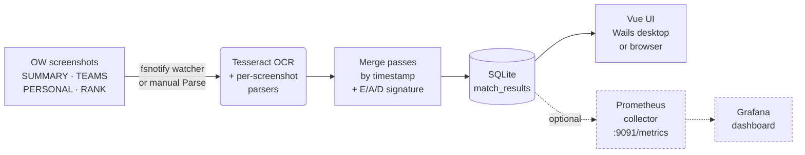

# Recall

[](https://github.com/sound-barrier/recall/actions/workflows/ci.yml)
[](https://github.com/sound-barrier/recall/actions/workflows/release.yml)
[](https://github.com/sound-barrier/recall/actions/workflows/pages.yml)
[](https://github.com/sound-barrier/recall/actions/workflows/codeql.yml)
[](https://github.com/sound-barrier/recall/releases/latest)
[](LICENSE)
[](https://go.dev/)
[](https://vuejs.org/)
[](https://sound-barrier.github.io/recall/)
[](https://sound-barrier.github.io/recall/api/)
[](CODE_OF_CONDUCT.md)

**Recall** is a desktop app for Overwatch players who want to understand
their performance trends over time. It watches a folder of OW post-match
screenshots, reads them with Tesseract OCR, and stores per-match data in a
local database. Optionally it exposes the match history as Prometheus metrics
so a bundled Grafana dashboard can chart win rates, SR trends, and per-hero stats.



📚 **Full documentation:** [sound-barrier.github.io/recall](https://sound-barrier.github.io/recall/) — installation guides, advanced usage, and the [API reference](https://sound-barrier.github.io/recall/api/). Auto-deployed from `main` on every doc change.

## Table of Contents

**Getting started**

- [Quick start](#quick-start)
- [Installation](#installation)
  - [Verifying downloads](#verifying-downloads)
  - [macOS](docs/install-macos.md) · [Linux](docs/install-linux.md)
- [Capturing matches](#capturing-matches)

**Advanced** — most users can skip these

- [🖥️ Use without the desktop app](docs/server.md) — browser access, headless mode, run on startup
- [🐳 Run in Docker](docs/docker.md) — containers, home lab, NAS
- [📊 Charts & Dashboards](docs/grafana.md) — Grafana, SR over time, win-rate charts

**Project**

- [Contributing](#contributing)
- [License](#license)

## Quick start

The desktop app is the simplest way to use Recall. Five steps from zero to your first match record:

1. **Install Recall** — grab `recall-{version}-windows-amd64-installer.exe` from [GitHub Releases](https://github.com/sound-barrier/recall/releases) and run it. For macOS or Linux, see the [Installation](#installation) section below.
2. **Install Tesseract OCR 5.x** — Recall uses it to read your screenshots. Download the **5.x** installer from [UB-Mannheim](https://github.com/UB-Mannheim/tesseract/wiki) and run it with the default options. Older 3.x / 4.x builds are detected and flagged with a warning — parsing may misread. (macOS/Linux instructions are in [docs/install-macos.md](docs/install-macos.md) and [docs/install-linux.md](docs/install-linux.md).)
3. **Launch Recall and pick a screenshots folder** under **Settings → Directories**. Overwatch's default on Windows is `Documents\Overwatch\ScreenShots\Overwatch\`.
4. **Capture screenshots in Overwatch** with **F12** after each match — see [Capturing matches](#capturing-matches) for which post-match tabs to screenshot.
5. **Click *Ingest → Run Parse*** to scan the folder, or flip on *Ingest → Parse → Watch Folder* to auto-parse as new screenshots land. Parsed matches appear under the **Matches** tab.

That's all most users need. The [Advanced](#advanced) sections below cover running Recall headless and streaming matches into a local Grafana dashboard — neither is required for everyday use.

## Installation

Pre-built binaries for every tagged release are on the [GitHub Releases](https://github.com/sound-barrier/recall/releases) page.

| Platform | Desktop app | Server binary |
|---|---|---|
| **Windows** | `recall-{version}-windows-amd64-installer.exe` | `recall-server-{version}-windows-amd64.exe` |
| macOS arm64 | `recall-{version}-darwin-arm64.dmg` | `recall-server-{version}-darwin-arm64.tar.gz` |
| Linux | `recall-{version}-linux-amd64.tar.gz` · `recall-{version}-linux-amd64.deb` | `recall-server-{version}-linux-amd64.tar.gz` · `recall-server-{version}-linux-amd64.deb` |
| Docker | — | `ghcr.io/sound-barrier/recall-server:latest` |

For macOS and Linux setup details (Gatekeeper bypass, package manager Tesseract install, data paths), see the platform guides:
- [Installing on macOS](docs/install-macos.md)
- [Installing on Linux](docs/install-linux.md)

### Verifying downloads

Every release binary ships with a `.sha256` checksum file — the
[macOS](docs/install-macos.md#verifying-your-download) and
[Linux](docs/install-linux.md#verifying-your-download) install guides
have the one-line `shasum --check` command. On Windows, PowerShell:

```powershell
(Get-FileHash recall-{version}-windows-amd64-installer.exe).Hash -eq `
  (Get-Content recall-{version}-windows-amd64-installer.exe.sha256).Split()[0].ToUpper()
```

`True` / `OK` means the file is intact; any mismatch means re-download.

For stronger supply-chain guarantees, every binary **and its `.sha256`
file** are also signed with [SLSA provenance](https://slsa.dev/) via
GitHub's Sigstore integration. Verify with the
[GitHub CLI](https://cli.github.com/):

```sh
gh attestation verify recall-{version}-windows-amd64-installer.exe --repo sound-barrier/recall
```

Every release also includes `recall-{version}-sbom.spdx.json` — a
software bill of materials listing every dependency.

## Capturing matches

Recall reads four kinds of post-match screenshots from Overwatch. Three are required for a complete match record; the fourth is optional but recommended for competitive play.

| Screenshot | Required? | What it provides |
|---|---|---|
| **SUMMARY** | ✅ Required | Match result (victory/defeat/draw), final score, map, mode, date, game length, and the list of heroes played with playtime percentages. |
| **TEAMS** (scoreboard) | ✅ Required | Eliminations, assists, deaths, damage, healing, mitigation. The in-game scoreboard (Tab key, mid-match) works as a fallback for the post-match tab. |
| **PERSONAL** | ✅ Required (one per hero played) | Per-hero detailed stats: weapon accuracy, ult charges, role-specific cards. If you played multiple heroes in a single match, take one PERSONAL screenshot for each. |
| **RANK** | ⭕ Optional (competitive only) | SR value, rank tier, rank change. Only appears after competitive matches. If it's missing but the SR change is captured, Recall infers the win/loss from the SR delta. |

The in-game screenshot key is **F12** by default (rebindable under *Options → Controls → General → Screenshot*). After a match ends, cycle through the post-match tabs and press F12 on each. Recall stitches the screenshots into a single match record using the filename timestamps Overwatch embeds — taking them within a couple of minutes of each other is enough.

Overwatch saves screenshots to `Documents\Overwatch\ScreenShots\Overwatch\` on Windows by default. Point Recall at that folder under **Settings → Directories**; the watcher (enabled under **Ingest → Parse → Watch Folder**) auto-parses any new `.png` / `.jpg` that lands in it.

**What if a screenshot type is missing?** Each match card has a *Data Coverage* strip in its expanded view that flags which of the four screenshot types were captured. Required-but-missing types are highlighted with a warning chip; the optional RANK is shown greyed out when absent. Screenshots Recall couldn't match to a known map collect in the **Unknown** tab for triage.

---

# Advanced

If you're just playing Overwatch and want to track your stats, you can stop
reading here — the desktop app is all you need.

| Guide | For when… |
|---|---|
| [🖥️ Use without the desktop app](docs/server.md) | You want browser access, or to run Recall on a headless machine. |
| [🐳 Run in Docker](docs/docker.md) | You run containers on a home lab or NAS. |
| [📊 Charts & Dashboards](docs/grafana.md) | You want SR-over-time graphs and win-rate charts in Grafana. |
| [📘 API reference](https://sound-barrier.github.io/recall/api/) | You want to read or try the HTTP API — Swagger UI rendering of the OpenAPI spec, auto-deployed from `main`. |

## Contributing

Bug reports, feature requests, and pull requests are welcome. See [CONTRIBUTING.md](CONTRIBUTING.md) for development setup, build instructions, coding conventions, and [git hook requirements](CONTRIBUTING.md#git-hooks-lefthook). The release/tagging process — automated via [release-please](https://github.com/googleapis/release-please), with `make release-beta` / `make release-fire` shortcuts for the manual bits — is documented in [RELEASES.md](RELEASES.md). Commits on `main` follow [Conventional Commits](https://www.conventionalcommits.org/).

By participating in this project — opening an issue, filing a PR, commenting on a discussion — you agree to follow the [Code of Conduct](CODE_OF_CONDUCT.md). Short version: be kind, and remember that Recall is given away free of charge and maintained in spare time, so no demands and no expectations of timely replies, bug fixes, or feature requests.

## License

Licensed under the [Apache License, Version 2.0](LICENSE).

Third-party dependency attribution is in [NOTICE](NOTICE). A full software bill of materials (SPDX) is attached to each [GitHub Release](https://github.com/sound-barrier/recall/releases).
