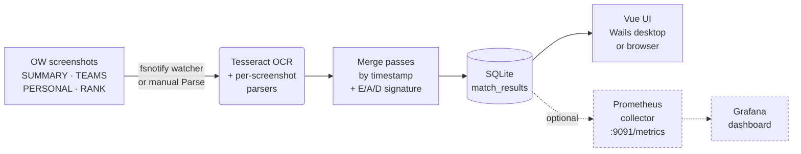

# Recall

**Recall** is a desktop app for Overwatch players who want to understand
their performance trends over time. It watches a folder of OW post-match
screenshots, reads them with Tesseract OCR, and stores per-match data in a
local database. Optionally it exposes the match history as Prometheus metrics
so a bundled Grafana dashboard can chart win rates, SR trends, and per-hero stats.



## Table of Contents

**Getting started**

- [Quick start](#quick-start)
- [Installation](#installation)
  - [macOS first launch](#macos-first-launch)
  - [Linux installation](#linux-installation)
  - [Verifying downloads](#verifying-downloads)
- [Prerequisites](#prerequisites)
- [Capturing matches](#capturing-matches)

**Advanced**

- [Running as a server](#running-as-a-server)
- [Running via Docker](#running-via-docker)
- [Metrics & Grafana](#metrics--grafana)
  - [Option A: Bundled Podman/Docker Compose (recommended)](#option-a-bundled-podmandocker-compose-recommended)
  - [Option B: Your own Docker/Podman containers](#option-b-your-own-dockerpodman-containers)
  - [Option C: Native installation (no containers)](#option-c-native-installation-no-containers)
  - [Troubleshooting](#troubleshooting)
  - [Metric overview](#metric-overview)

**Project**

- [Contributing](#contributing)
- [License](#license)

## Quick start

The desktop app is the simplest way to use Recall. Five steps from zero to your first match record:

1. **Install Recall** — grab the `.dmg` (macOS), `.deb` / `.tar.gz` (Linux), or `.exe` (Windows) from [GitHub Releases](https://github.com/sound-barrier/recall/releases). See [Installation](#installation) for per-platform notes.
2. **Install Tesseract OCR** — Recall shells out to it to read your screenshots.
   - macOS: `brew install tesseract`
   - Linux: `sudo apt install tesseract-ocr`
   - Windows: [UB-Mannheim installer](https://github.com/UB-Mannheim/tesseract/wiki)
3. **Launch Recall and pick a screenshots folder** under **Settings → Directories**. On Windows, Overwatch's default is `Documents\Overwatch\ScreenShots\Overwatch\`.
4. **Capture screenshots in Overwatch** with **F12** after each match — see [Capturing matches](#capturing-matches) for which post-match tabs to screenshot.
5. **Click *Ingest → Run Parse*** to scan the folder, or flip on *Ingest → Parse → Watch Folder* to auto-parse as new screenshots land. Parsed matches appear under the **Matches** tab.

That's all most users need. The [Advanced](#advanced) sections below cover running Recall headless and streaming matches into a local Grafana dashboard — neither is required for everyday use.

## Installation

Pre-built binaries for every tagged release are on the [GitHub Releases](https://github.com/sound-barrier/recall/releases) page.

| Platform | Wails desktop app | Server binary |
|---|---|---|
| Linux | `recall-{version}-linux-amd64.tar.gz` · `recall-{version}-linux-amd64.deb` | `recall-server-{version}-linux-amd64.tar.gz` · `recall-server-{version}-linux-amd64.deb` |
| Windows | `recall-{version}-windows-amd64.exe` | `recall-server-{version}-windows-amd64.exe` |
| macOS arm64 | `recall-{version}-darwin-arm64.dmg` | `recall-server-{version}-darwin-arm64.tar.gz` |
| Docker | — | `ghcr.io/sound-barrier/recall-server:latest` |

### macOS first launch

The `.dmg` is not notarized (notarization requires an Apple Developer certificate). macOS will block the app on first open with a warning about unverified software. To bypass it, **right-click the app → Open**, then click **Open** in the dialog that appears. You only need to do this once; subsequent launches work normally.

Alternatively, from Terminal:
```sh
xattr -d com.apple.quarantine /Applications/Recall-arm64.app
```

Or go to **System Settings → Privacy & Security** and click **Open Anyway** after the first blocked launch.

### Linux installation

`.deb` packages install the binary to `/usr/local/bin/`:

```sh
sudo dpkg -i recall-{version}-linux-amd64.deb         # installs /usr/local/bin/recall
sudo dpkg -i recall-server-{version}-linux-amd64.deb  # installs /usr/local/bin/recall-server
```

### Verifying downloads

Every release binary and package ships with a companion `.sha256` file containing its SHA256 hash. Download both the artifact and its `.sha256` file, then verify:

```sh
# Linux / WSL
sha256sum --check recall-{version}-linux-amd64.tar.gz.sha256

# macOS
shasum -a 256 --check recall-{version}-darwin-arm64.dmg.sha256
```

`sha256sum` prints `OK` when the file matches what was built in CI; any mismatch prints `FAILED` and exits non-zero.

Every release also includes `recall-{version}-sbom.spdx.json` — a bill of materials listing every dependency the release was built from.

## Prerequisites

- **Tesseract OCR** — required for screenshot parsing. Install via Homebrew (`brew install tesseract`) on macOS, `apt install tesseract-ocr` on Linux, or the [Windows installer](https://github.com/UB-Mannheim/tesseract/wiki). On first launch Recall auto-detects the standard install path; use **Ingest → Engine** to point it elsewhere if needed.

Settings and the match database are stored in the platform user-config directory:
- macOS: `~/Library/Application Support/Recall/`
- Linux: `~/.config/recall/`
- Windows: `%AppData%\Recall\`

## Capturing matches

Recall reads four kinds of post-match screenshots from Overwatch. Three are required for a complete match record; the fourth is optional but recommended for competitive play.

| Screenshot | Required? | What it provides |
|---|---|---|
| **SUMMARY** | ✅ Required | Match result (victory/defeat/draw), final score, map, mode, date, game length, and the list of heroes played with playtime percentages. |
| **TEAMS** (scoreboard) | ✅ Required | Eliminations, assists, deaths, damage, healing, mitigation. The in-game scoreboard (Tab key, mid-match) works as a fallback for the post-match tab. |
| **PERSONAL** | ✅ Required (one per hero played) | Per-hero detailed stats: weapon accuracy, ult charges, role-specific cards. If you played multiple heroes in a single match, take one PERSONAL screenshot for each. |
| **RANK** | ⭕ Optional (competitive only) | SR value, rank tier, rank change. Only appears after competitive matches. If it's missing but the SR change is captured, Recall infers the win/loss from the SR delta. |

The in-game screenshot key is **F12** by default (rebindable under *Options → Controls → General → Screenshot*). After a match ends, cycle through the post-match tabs and press F12 on each. Recall stitches the screenshots into a single match record using the filename timestamps Overwatch embeds — taking them within a couple of minutes of each other is enough.

Overwatch saves screenshots to `Documents\Overwatch\ScreenShots\Overwatch\` on Windows by default. Point Recall at that folder under **Settings → Directories**; the watcher (enabled under **Ingest → Parse → Watch Folder**) auto-parses any new `.png` / `.jpg` that lands in it.

**What if a screenshot type is missing?** Each match card has a *Data Coverage* strip in its expanded view that flags which of the four screenshot types were captured. Required-but-missing types are highlighted with a warning chip; the optional RANK is shown greyed out when absent. Screenshots Recall couldn't match to a known map collect in the **Unknown** tab for triage.

---

# Advanced

The sections below cover headless deployment, Docker containers, and the optional Prometheus/Grafana integration. If you're using the desktop app and just want to see your matches, you can stop reading here — these aren't required for normal use.

## Running as a server

> 🔧 **Advanced.** Skip this unless you specifically want to run Recall on a machine without a display (a home server, a remote box, a Raspberry Pi) and access the UI from a browser on another device.

In addition to the desktop app, Recall can run as a headless HTTP server. Open `http://127.0.0.1:7000` in any browser on the same machine to access the full match dashboard.

```sh
./Recall-server                 # dedicated server binary — always starts in HTTP mode
./Recall --server               # Wails binary with runtime flag — same HTTP mode
./Recall -s                     # short form
```

The server listens on `http://127.0.0.1:7000` by default (localhost-only). Set
`RECALL_SERVER_ADDR` to override (e.g. `RECALL_SERVER_ADDR=0.0.0.0:7000` to accept
connections from other hosts on your network). Recall has no authentication —
when binding to a non-loopback address, put it behind a reverse proxy with auth
(or restrict access at the network layer). Endpoints that accept filesystem
paths (`/api/screenshots-dir`, `/api/tesseract-path`) validate input before it
reaches `os.Stat` / `exec.Command`; see the validation rules in each
endpoint's description in the spec below.

The HTTP REST + SSE surface is documented in [`api/openapi.yaml`](api/openapi.yaml) (OpenAPI 3.1.0). Browse it with `make swagger` to spin up Swagger UI at <http://localhost:8080>, or point any OpenAPI-compatible client at the YAML directly.

## Running via Docker

> 🐳 **Most advanced.** You only need this if you want to run Recall inside a container (e.g. alongside other containerized services on a NAS or home lab). For everyday use, the desktop app or the bare server binary above is simpler — you don't need to install Docker just to use Recall.

A pre-built Docker image with Tesseract included is pushed to GHCR on every tagged release. The `:latest` tag tracks the most recent **stable** release; prereleases (tags with a hyphenated suffix like `v0.1.0-beta.0`) publish only their exact `:<version>` and never move `:latest`, so `docker pull recall-server:latest` always lands on a non-prerelease build.

```sh
docker run \
  -e RECALL_SERVER_ADDR=0.0.0.0:7000 \
  -p 7000:7000 \
  ghcr.io/sound-barrier/recall-server:latest
```

Open `http://localhost:7000` in your browser once the container is running. The example above is the bare minimum and doesn't persist anything — for real use, bind-mount your screenshots folder (read-only is fine) and a volume for the SQLite database + settings:

```sh
docker run \
  -e RECALL_SERVER_ADDR=0.0.0.0:7000 \
  -p 7000:7000 \
  -v ~/Documents/Overwatch/ScreenShots/Overwatch:/screenshots:ro \
  -v recall-data:/root/.config/recall \
  ghcr.io/sound-barrier/recall-server:latest
```

Then open the UI, go to **Settings → Directories → Change Folder…**, and point it at `/screenshots`. The `recall-data` named volume keeps your parsed matches and settings across container restarts.

## Metrics & Grafana

> 📊 **Advanced — optional.** Recall already shows your full match history in the **Matches** tab without any of this. Set up Prometheus + Grafana only if you want time-series dashboards (win-rate trends, SR over time, damage-vs-healing scatter) on top of the in-app views.

The app exposes its parsed match history as Prometheus metrics on
`http://localhost:9091/metrics` whenever it's running. Each sample carries
the match's actual end time (`date + finished_at`) as its timestamp, so
Grafana plots match stats at the moment they happened — not at scrape time.

Three options are available for running Prometheus and Grafana, in increasing order of complexity.

### Option A: Bundled Podman/Docker Compose (recommended)

The repo ships `docker-compose.yml` and helper scripts that start a
pre-configured Prometheus + Grafana stack with the Recall dashboard
auto-provisioned.

**One-time (macOS):**

```sh
brew install podman podman-compose   # skip if using Docker Desktop / Colima
```

```sh
./scripts/stack-up.sh                # starts podman VM if needed, then compose up
./scripts/stack-down.sh              # stop (volumes preserved)
./scripts/stack-down.sh --machine    # also stop the podman VM
./scripts/prometheus-clear.sh        # wipe Prometheus TSDB only
```

- Prometheus: <http://localhost:9090>
- Grafana: <http://localhost:3000>  (login `admin` / `admin`)

The compose file is plain v3 — `docker compose` (Docker Desktop / Colima) also
works. Podman is what we test against.

### Option B: Your own Docker/Podman containers

Use the repo's config files with any container runtime. On Linux add
`--add-host host.docker.internal:host-gateway` so the container can reach
the host's Prometheus metrics port; on macOS and Windows with Docker Desktop
or Podman Desktop `host.docker.internal` resolves automatically.

```sh
# Prometheus — mounts the repo's prometheus.yml (includes the out-of-order window)
docker run -d \
  --name recall-prometheus \
  -p 9090:9090 \
  -v "$(pwd)/prometheus.yml:/etc/prometheus/prometheus.yml:ro" \
  prom/prometheus:v2.53.0

# Grafana — mounts the repo's provisioning directory (datasource + dashboard)
docker run -d \
  --name recall-grafana \
  -p 3000:3000 \
  --link recall-prometheus:prometheus \
  -v "$(pwd)/grafana/provisioning:/etc/grafana/provisioning:ro" \
  grafana/grafana:11.1.0
```

On Linux, add `--add-host host.docker.internal:host-gateway` to the
Prometheus `docker run` command. Grafana defaults: `admin` / `admin`.

### Option C: Native installation (no containers)

Install Prometheus and Grafana as local services. Before copying the
config files, make two edits:

1. In `prometheus.yml`: change the scrape target from
   `host.docker.internal:9091` to `localhost:9091`.
2. In `grafana/provisioning/datasources/prometheus.yml`: change the
   datasource URL from `http://prometheus:9090` to `http://localhost:9090`.

**macOS (Homebrew):**

```sh
brew install prometheus grafana

cp prometheus.yml /opt/homebrew/etc/prometheus.yml
mkdir -p /opt/homebrew/etc/grafana/provisioning
cp -r grafana/provisioning/. /opt/homebrew/etc/grafana/provisioning/

brew services start prometheus
brew services start grafana
```

**Linux:**

```sh
# Prometheus — download from https://prometheus.io/download/ and extract
sudo cp prometheus.yml /etc/prometheus/prometheus.yml
sudo systemctl restart prometheus

# Grafana — add the Grafana apt repo per https://grafana.com/docs/grafana/latest/setup-grafana/installation/debian/
sudo apt install -y grafana
sudo cp -r grafana/provisioning/. /etc/grafana/provisioning/
sudo systemctl restart grafana-server
```

**Windows:**

```powershell
winget install Grafana.Grafana
# Prometheus: download from https://prometheus.io/download/; extract anywhere

# Copy prometheus.yml to the Prometheus working directory
# Copy grafana/provisioning/ to Grafana's conf/provisioning/ directory
# Start both services
```

> **Grafana datasource UID**: every panel in `recall.json` hardcodes
> `"datasource": {"uid": "prometheus"}`. The provisioning file pins this
> UID automatically. If you add the datasource manually in the Grafana UI
> instead of using provisioning, set the **UID** field to exactly
> `prometheus` — otherwise all panels show "datasource not found".

### Troubleshooting

**Grafana shows no data / unsure if metrics are flowing**
Run the verifier — it walks SQLite → /metrics → Prometheus container →
scrape state → TSDB and prints a ✓/✗ for each layer:

```sh
./scripts/verify-stack.sh
```

The first ✗ line tells you which stage is broken; the rest of the script
keeps going so you see the state of everything else too.

**`Cannot connect to the Docker daemon …` / `podman ps` exits 125**
The Linux VM that hosts the daemon isn't running. For Podman, run
`podman machine start` (one-time `podman machine init` if it's never been
created). For Docker on Homebrew, you'll need a separate runtime —
`colima start` is the easiest.

**`error getting credentials … docker-credential-gcloud … executable file not found`**
Your `~/.docker/config.json` has a `credsStore` or `credHelpers` entry
(usually left behind by `gcloud auth configure-docker`). Podman's image-pull
path falls back to `~/.docker/config.json` for credential helpers even when
its own `auth.json` exists, so just creating an empty Podman auth file
does NOT fix this — you have to strip the entries from the Docker config
itself:

```sh
cp ~/.docker/config.json ~/.docker/config.json.bak
jq 'del(.credsStore, .credHelpers)' ~/.docker/config.json > /tmp/dc \
  && mv /tmp/dc ~/.docker/config.json
podman-compose down                 # clear any half-started state
podman-compose up -d
```

This removes both the global `credsStore` line and the per-registry
`credHelpers` map; any `auths` or other settings in the file are
preserved. To restore the gcloud helpers later, either
`cp ~/.docker/config.json.bak ~/.docker/config.json` or re-run
`gcloud auth configure-docker`.

The "Recall" dashboard is auto-provisioned: eliminations per match, SR
over time, win rate by hero, and damage-vs-healing scatter.

Override the metrics endpoint address with `OWMETRICS_METRICS_ADDR` (e.g.
`OWMETRICS_METRICS_ADDR=:9292 wails dev`). Prometheus accepts historical
timestamps because the stack runs with `--storage.tsdb.out-of-order-time-window=8760h`.

### Metric overview

| Metric | Labels | Notes |
|---|---|---|
| `recall_match_eliminations` (and `_assists`, `_deaths`, `_damage`, `_healing`, `_mitigation`) | `match_key, map, type, mode, result, hero, role` | Core scoreboard stats. |
| `recall_match_result` | …, `result` | Constant `1`; `count()` in Grafana gives match counts grouped by outcome. |
| `recall_match_rank_level` | … | Competitive rank sub-division (1–5). |
| `recall_match_sr` / `recall_match_sr_change` | …, `hero`, `role` | Per-hero SR + delta from each match. |
| `recall_hero_stat` | …, `hero`, `role`, `stat` | Open-ended per-hero stats (`weapon_accuracy`, `players_saved`, …). |

## Contributing

Bug reports, feature requests, and pull requests are welcome. See [CONTRIBUTING.md](CONTRIBUTING.md) for development setup, build instructions, coding conventions, and [pre-commit hook requirements](CONTRIBUTING.md#pre-commit-hooks-lefthook). The release/tagging process — automated via [release-please](https://github.com/googleapis/release-please), with `make release-beta` / `make release-fire` shortcuts for the manual bits — is documented in [RELEASES.md](RELEASES.md). Commits on `main` follow [Conventional Commits](https://www.conventionalcommits.org/).

## License

Licensed under the [Apache License, Version 2.0](LICENSE).

Third-party dependency attribution is in [NOTICE](NOTICE). A full software bill of materials (SPDX) is attached to each [GitHub Release](https://github.com/sound-barrier/recall/releases).
