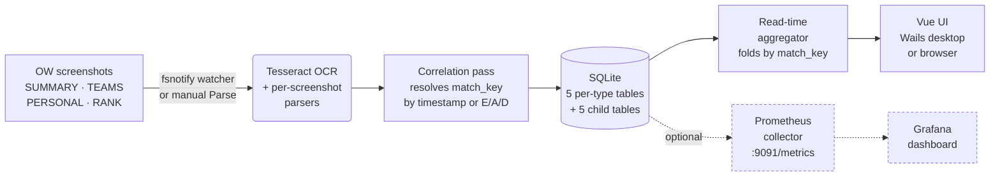

# Recall

[](https://github.com/sound-barrier/recall/actions/workflows/ci.yml)
[](https://github.com/sound-barrier/recall/actions/workflows/release.yml)
[](https://github.com/sound-barrier/recall/actions/workflows/pages.yml)
[](https://github.com/sound-barrier/recall/actions/workflows/codeql.yml)
[](https://github.com/sound-barrier/recall/releases/latest)
[](LICENSE)
[](https://go.dev/)
[](https://vuejs.org/)
[](https://sound-barrier.github.io/recall/)
[](https://sound-barrier.github.io/recall/api/)
[](CODE_OF_CONDUCT.md)
[](ROADMAP.md)

**Recall** is a desktop app for Overwatch players who want to understand
their performance trends over time. It watches a folder of OW post-match
screenshots, reads them with Tesseract OCR, and stores per-match data in a
local database. Optionally it exposes the match history as Prometheus metrics
so a bundled Grafana dashboard can chart win rates, SR trends, and per-hero stats.



## What it looks like

<table>
<tr>
<th align="left">Matches view</th>
<th align="left">Match detail panel</th>
</tr>
<tr>
<td valign="top" width="50%">
<a href="docs/screenshots/matches-view.png"></a>
<sub>The Matches tab is a *set workspace*: a customizable dossier at the top (W/L/D, win rate, top maps/heroes, active-clause chips — drag to reorder, remove, or re-add any KPI/breakdown widget), the full-width Campaign Log heatmap + Geography (Map × Role) band below it, and the compact leaf-row list at the bottom. The left-side **Filter matches** panel consolidates every filter dimension into one place.</sub>
</td>
<td valign="top" width="50%">
<a href="docs/screenshots/match-detail-panel.png"></a>
<sub>Click a row (or press <code>e</code>) to slide in the per-match dossier: leaver chooser, Match Stats grid, Rank Update card, Match Journal (notes / replay code / group / tags), Heroes Played, and the source screenshots. <code>←/→</code> paginate; <code>Esc</code> closes.</sub>
</td>
</tr>
</table>

📚 **Full documentation:** [sound-barrier.github.io/recall](https://sound-barrier.github.io/recall/) — installation guides, advanced usage, and the [API reference](https://sound-barrier.github.io/recall/api/). Auto-deployed from `main` on every doc change.

## Table of Contents

**Getting started**

- [Quick start](#quick-start)
- [Installation](#installation)
  - [Verifying downloads](#verifying-downloads)
  - [Windows](docs/install-windows.md) · [macOS](docs/install-macos.md) · [Linux](docs/install-linux.md)
- [Capturing matches](#capturing-matches)
- [Troubleshooting](#troubleshooting)

**Advanced** — most users can skip these

- [🖥️ Use without the desktop app](docs/server.md) — browser access, headless mode, run on startup
- [🐳 Run in Docker](docs/docker.md) — containers, home lab, NAS
- [📊 Charts & Dashboards](docs/grafana.md) — Grafana, SR over time, win-rate charts

**Project**

- [Roadmap](ROADMAP.md) — what's shipping next, what's deferred, why
- [Contributing](#contributing)
- [License](#license)

## Quick start

The desktop app is the simplest way to use Recall. Five steps from zero to your first match record:

1. **Install Recall** — grab `recall-{version}-windows-amd64-installer.exe` from [GitHub Releases](https://github.com/sound-barrier/recall/releases) and run it. Full step-by-step in the [Windows install guide](docs/install-windows.md). For macOS or Linux, see the [Installation](#installation) section below.
2. **Install Tesseract OCR 5.x** — Recall uses it to read your screenshots. Download the **5.x** installer from [UB-Mannheim](https://github.com/UB-Mannheim/tesseract/wiki) and run it with the default options. Older 3.x / 4.x builds are detected and flagged with a warning — parsing may misread. (macOS/Linux instructions are in [docs/install-macos.md](docs/install-macos.md) and [docs/install-linux.md](docs/install-linux.md).)
3. **Launch Recall and pick a screenshots folder.** The first-run Settings screen surfaces a four-card picker for the canonical Windows capture sources — **Nvidia Overlay**, **OW PrntScn default**, **Win Snip tool**, and **Steam install** — each with a status dot showing whether the path exists on your machine. One click on a found card sets it as the watched folder. A "Pick a different folder…" tile under the grid covers everything else. On macOS / Linux the grid is hidden; the manual folder picker is the only path.
4. **Capture screenshots in Overwatch** with **F12** after each match — see [Capturing matches](#capturing-matches) for which post-match tabs to screenshot. Recall recognises Nvidia Overlay, OW's default PrntScn, Windows Snip, and Steam in-game F12 filename shapes automatically (full list of supported formats below step 5).
5. **Click *Parse → Run Parse*** to scan the folder, or flip on *Parse → Watch Folder* to auto-parse as new screenshots land. Parsed matches appear under the **Matches** tab.

Recall recognises four capture-tool filename shapes automatically: **Nvidia Overlay** (`Overwatch 2 Screenshot YYYY.MM.DD - HH.MM.SS.ff.png`), **OW's default PrntScn** (`ScreenShot_YY-MM-DD_HH-MM-SS-fff.jpg`), **Windows Snip** (`Screenshot YYYY-MM-DD HHMMSS.png`), and **Steam's in-game F12** (`YYYYMMDDHHMMSS_N.jpg`).

The masthead's **Check for updates** button compares your installed Recall against the latest release on GitHub AND surfaces any new heroes / maps / capture-tool grammars added since your build shipped — apply them in-place without reinstalling. The app also shows a quiet "you haven't checked in a while" banner roughly every 90 days so a stale install gets nudged. See [Updates & game data](docs/settings-reference.md#updates--game-data) for the full flow.

That's all most users need. The [Advanced](#advanced) sections below cover running Recall headless and streaming matches into a local Grafana dashboard — neither is required for everyday use.

## Installation

Pre-built binaries for every tagged release are on the [GitHub Releases](https://github.com/sound-barrier/recall/releases) page.

| Platform | Desktop app | Server binary |
|---|---|---|
| **Windows** | `recall-{version}-windows-amd64-installer.exe` | `recall-server-{version}-windows-amd64.exe` |
| macOS arm64 | `recall-{version}-darwin-arm64.dmg` | `recall-server-{version}-darwin-arm64.tar.gz` |
| Linux | `recall-{version}-linux-amd64.tar.gz` · `recall-{version}-linux-amd64.deb` | `recall-server-{version}-linux-amd64.tar.gz` · `recall-server-{version}-linux-amd64.deb` |
| Docker | — | `ghcr.io/sound-barrier/recall-server:latest` |

For per-platform setup details (SmartScreen / Gatekeeper bypass, package-manager Tesseract install, data paths), see the platform guides:

- [Installing on Windows](docs/install-windows.md)
- [Installing on macOS](docs/install-macos.md)
- [Installing on Linux](docs/install-linux.md)

### Verifying downloads

Every release binary ships with a `.sha256` checksum file — the
[macOS](docs/install-macos.md#verifying-your-download) and
[Linux](docs/install-linux.md#verifying-your-download) install guides
have the one-line `shasum --check` command. On Windows, PowerShell:

```powershell
(Get-FileHash recall-{version}-windows-amd64-installer.exe).Hash -eq `
  (Get-Content recall-{version}-windows-amd64-installer.exe.sha256).Split()[0].ToUpper()
```

`True` / `OK` means the file is intact; any mismatch means re-download.

For stronger supply-chain guarantees, every binary **and its `.sha256`
file** are also signed with [SLSA provenance](https://slsa.dev/) via
GitHub's Sigstore integration. Verify with the
[GitHub CLI](https://cli.github.com/):

```sh
gh attestation verify recall-{version}-windows-amd64-installer.exe --repo sound-barrier/recall
```

Every release also includes `recall-{version}-sbom.spdx.json` — a
software bill of materials listing every dependency.

## Capturing matches

Recall reads four kinds of post-match screenshots from Overwatch. Three are required for a complete match record; the fourth is optional but recommended for competitive play.

| Screenshot | Required? | What it provides |
|---|---|---|
| **SUMMARY** | ✅ Required | Match result (victory/defeat/draw), final score, map, mode, date, game length, and the list of heroes played with playtime percentages. |
| **TEAMS** (scoreboard) | ✅ Required | Eliminations, assists, deaths, damage, healing, mitigation. The in-game scoreboard (Tab key, mid-match) works as a fallback for the post-match tab. |
| **PERSONAL** | ✅ Required (one per hero played) | Per-hero detailed stats: weapon accuracy, ult charges, role-specific cards. If you played multiple heroes in a single match, take one PERSONAL screenshot for each. |
| **RANK** | ⭕ Optional (competitive only) | SR value, rank tier, rank change. Only appears after competitive matches. If it's missing but the SR change is captured, Recall infers the win/loss from the SR delta. |

The in-game screenshot key is **F12** by default (rebindable under *Options → Controls → General → Screenshot*). After a match ends, cycle through the post-match tabs and press F12 on each. Recall stitches the screenshots into a single match record using the filename timestamps Overwatch embeds — taking them within a couple of minutes of each other is enough.

Overwatch saves screenshots to `Documents\Overwatch\ScreenShots\Overwatch\` on Windows by default — but the Settings first-run picker also supports **Nvidia Overlay** (`~\Videos\Overwatch`), **Win Snip tool** (`~\Pictures\Screenshots`), and **Steam-installed OW** (`<SteamInstall>\userdata\<id>\760\remote\<OW-app-id>\screenshots`). Point Recall at whichever you use; the watcher (enabled under **Parse → Watch Folder**) auto-parses any new `.png` / `.jpg` that lands in it.

**What if a screenshot type is missing?** Each match row has a *Data Coverage* strip in the detail panel (click any row to open) that flags which of the four screenshot types were captured. Required-but-missing types are highlighted with a warning chip; the optional RANK is shown greyed out when absent. Screenshots Recall couldn't match to a known map collect in the **Unknown** tab for triage — alongside any record whose hero or map text didn't match the canonical roster shipped with this release (see [Reference data gaps](docs/unknown-screenshots.md#reference-data-gaps) for what to do).

### Bulk-set play mode + queue type

The Matches list has per-row checkboxes (left column). Tick one or more rows and a sticky toolbar appears at the top of the list: **Select all (N)** / **Clear** / **Set play mode ▾** (Quickplay / Competitive / Clear) / **Set queue ▾** (Role Queue / Open Queue / Clear). Each menu pick fires a single bulk write across every selected row — fast even on hundreds of matches at once. Your annotations / hidden flags / reviews all key on `match_key`, so bulk-set never disturbs the user-curated metadata.

### Multiple accounts (profiles)

Got more than one Overwatch account? Each profile in Recall is a fully separate workspace — its own screenshots folder, settings, and SQLite database. The chip in the upper right of the masthead lists every profile, switches between them in one click, and supports inline create + rename so you can name them whatever you want (`SilentStorm`, `Jokester`, `Manny`). Switching profiles re-loads every data surface (dossier, heatmap, Archive) against that profile's history.

If you accidentally ingest a smurf game into the wrong profile, the Matches view's bulk-select supports a **Move to…** action that transfers the ticked matches (plus their annotations and hidden flags) into another profile in one shot. No manual SQL needed.

You can also scope a single launch to a specific profile via `--profile=<name>` on either binary — useful for opening an alt account once without changing the persisted default. The full [data layout is documented under *How it works → Where things live on disk*](docs/how-it-works.md#where-things-live-on-disk).

### What each screenshot type looks like

Real examples from Recall's parser-regression fixture set. The same PNG files live under `testdata/` in this repo and are the inputs `TestParseScreenshot_GoldenFiles` runs against on every change. Click any image for the full-resolution source.

<table>
<tr>
<th align="left">SUMMARY</th>
<th align="left">TEAMS scoreboard</th>
</tr>
<tr>
<td valign="top" width="50%">
<a href="testdata/Overwatch%202%20Screenshot%202026.05.24%20-%2022.36.31.03.png"></a>
<sub>Antarctic Peninsula · comp victory 2-1. The map name + game type + heroes-played list + per-10-min averages all come from this tab.</sub>
</td>
<td valign="top" width="50%">
<a href="testdata/Overwatch%202%20Screenshot%202026.05.24%20-%2022.36.33.04.png"></a>
<sub>Same match. Eliminations / assists / deaths / damage / healing / mitigation all come from the highlighted row + the right-hand stat panel.</sub>
</td>
</tr>
<tr>
<th align="left" colspan="2">PERSONAL (one per hero played)</th>
</tr>
<tr>
<td valign="top" width="50%">
<a href="testdata/Overwatch%202%20Screenshot%202026.05.24%20-%2022.36.34.50.png"></a>
<sub>Juno's PERSONAL tab. The 3×3 grid populates hero-specific stats (pulsar torpedoes damage, orbital ray healing, players saved, weapon accuracy).</sub>
</td>
<td valign="top" width="50%">
<a href="testdata/Overwatch%202%20Screenshot%202026.05.24%20-%2022.36.36.31.png"></a>
<sub>Mizuki's PERSONAL tab from the same match — the player swapped from Juno (67% played) to Mizuki (33% played). Recall captures one PERSONAL per hero and merges them into the same match record.</sub>
</td>
</tr>
</table>

> **RANK screen** — no fixture in the test corpus yet (rank screens hadn't been captured at fixture-curation time). The RANK tab shows your current competitive rank tier + per-hero SR values + the recent change — Recall parses it the same way as the others when it's present.

## Troubleshooting

First-run friction tends to land in one of a handful of spots. The deep-links go to the platform install guides where the exact commands live.

<details>
<summary><strong>Tesseract isn't found / parse fails immediately</strong></summary>

Recall shells out to Tesseract 5.x to read screenshot text. If the Engine row in **Settings → Engine** shows a red "Not found" chip, or the Parse button stays disabled with "Tesseract required":

1. Install Tesseract 5.x from your platform's guide — [Windows](docs/install-windows.md#4-install-tesseract-5x) (UB-Mannheim installer), [macOS](docs/install-macos.md#4-install-tesseract-5x) (`brew install tesseract`), [Linux](docs/install-linux.md#4-install-tesseract-5x) (`apt install tesseract-ocr`).
2. Click **Settings → Engine → Detect** — Recall walks the per-OS install locations + `PATH` looking for a working 5.x binary.
3. If Detect comes up empty, click **Locate Tesseract…** and point Recall at the binary directly (`C:\Program Files\Tesseract-OCR\tesseract.exe` on Windows, `/opt/homebrew/bin/tesseract` on Apple Silicon, `/usr/bin/tesseract` on most Linux distros).
4. Tesseract **3.x / 4.x predate the OW post-match font** and misread reliably — the Engine row flags older versions but the parse-accuracy hit is the real reason to upgrade.

</details>

<details>
<summary><strong>"Cannot access folder" / screenshots folder permission denied</strong></summary>

The watcher and Parse-run both need read access to the directory you picked in **Settings → Directories**. If you see "Cannot access X. Check that you have read access or try a different folder.":

- **Windows OneDrive sync** — `Documents\Overwatch\…` or `Pictures\Screenshots\…` under OneDrive can flip to *Files On-Demand* (cloud-only placeholders). Right-click the Overwatch screenshots subfolder → **Always keep on this device**, or move your OW screenshot output to a non-synced path.
- **macOS app sandbox** — first-time access to `~/Documents` or `~/Pictures` may prompt for Recall in **System Settings → Privacy & Security → Files and Folders**. Tick the relevant folder and re-pick it under Settings.
- **Linux symlinks** — Recall resolves the picked path via `filepath.Clean` and rejects anything containing `..` or symlink-escapes outside the watched tree. Pick the *real* directory, not a symlink to it.
- The picked folder must be a **directory** (not a file or device); the Settings probe surfaces "Not a directory" when this is wrong.

</details>

<details>
<summary><strong>Reset Recall's database (per-OS)</strong></summary>

To start fresh on a single profile, or to recover from a corrupted database. Close Recall first, then:

| OS | Wipe one profile's matches | Wipe everything |
|---|---|---|
| **Windows** | `Remove-Item -Recurse "$env:AppData\Recall\profiles\<name>\db\"` | `Remove-Item -Recurse "$env:AppData\Recall"` |
| **macOS** | `rm -rf ~/Library/Application\ Support/Recall/profiles/<name>/db/` | `rm -rf ~/Library/Application\ Support/Recall/` |
| **Linux** | `rm -rf ~/.config/recall/profiles/<name>/db/` | `rm -rf ~/.config/recall/` |

A softer in-app option exists too: **Settings → Advanced → Clear Database** wipes the active profile's matches but keeps its settings + the ignored-screenshots suppress list (tick the opt-out checkbox to also clear that list). The two-step arm/confirm prevents accidental wipes.
</details>

<details>
<summary><strong>Port conflict / "address already in use"</strong></summary>

Two ports matter, both `localhost`-only:

- **`:9091` (Prometheus metrics)** — only opens when you flip **Settings → Advanced → Stream to Grafana** on. If another process is on `:9091`, the toggle silently fails. Free the port (`lsof -iTCP:9091 -sTCP:LISTEN` / Windows `Get-NetTCPConnection -LocalPort 9091`) and toggle again.
- **`:34115` (Wails IPC, dev only)** — only used by `make dev`; the production app uses an OS-allocated port. If `make dev` errors with "bind: address already in use", another `wails dev` is already running — kill it.
- **`:7000` (server mode)** — only when you run `recall-server --server` per [docs/server.md](docs/server.md). Override with `--addr 127.0.0.1:7099` if `:7000` is busy.

The Wails desktop app does NOT open any externally-visible port by default — the IPC bridge is in-process between the Go runtime and the embedded WebKit/WebView window.
</details>

If none of the above match, the [platform install guides](docs/install-macos.md) carry the long form, and [CONTRIBUTING.md → Bug-report bundles](CONTRIBUTING.md#bug-report-bundles) describes how to ship a reproducible payload to a bug report.

---

# Advanced

If you're just playing Overwatch and want to track your stats, you can stop
reading here — the desktop app is all you need.

| Guide | For when… |
|---|---|
| [🖥️ Use without the desktop app](docs/server.md) | You want browser access, or to run Recall on a headless machine. |
| [🐳 Run in Docker](docs/docker.md) | You run containers on a home lab or NAS. |
| [📊 Charts & Dashboards](docs/grafana.md) | You want SR-over-time graphs and win-rate charts in Grafana. |
| [📘 API reference](https://sound-barrier.github.io/recall/api/) | You want to read or try the HTTP API — Swagger UI rendering of the OpenAPI spec, auto-deployed from `main`. |

## Contributing

Bug reports, feature requests, and pull requests are welcome. See [CONTRIBUTING.md](CONTRIBUTING.md) for development setup, build instructions, coding conventions, and [git hook requirements](CONTRIBUTING.md#git-hooks-lefthook). The release/tagging process — automated via [release-please](https://github.com/googleapis/release-please), with `make release-beta` / `make release-fire` shortcuts for the manual bits — is documented in [RELEASES.md](RELEASES.md). Commits on `main` follow [Conventional Commits](https://www.conventionalcommits.org/).

By participating in this project — opening an issue, filing a PR, commenting on a discussion — you agree to follow the [Code of Conduct](CODE_OF_CONDUCT.md). Short version: be kind, and remember that Recall is given away free of charge and maintained in spare time, so no demands and no expectations of timely replies, bug fixes, or feature requests.

## License

Licensed under the [Apache License, Version 2.0](LICENSE).

Third-party dependency attribution is in [NOTICE](NOTICE). A full software bill of materials (SPDX) is attached to each [GitHub Release](https://github.com/sound-barrier/recall/releases).
