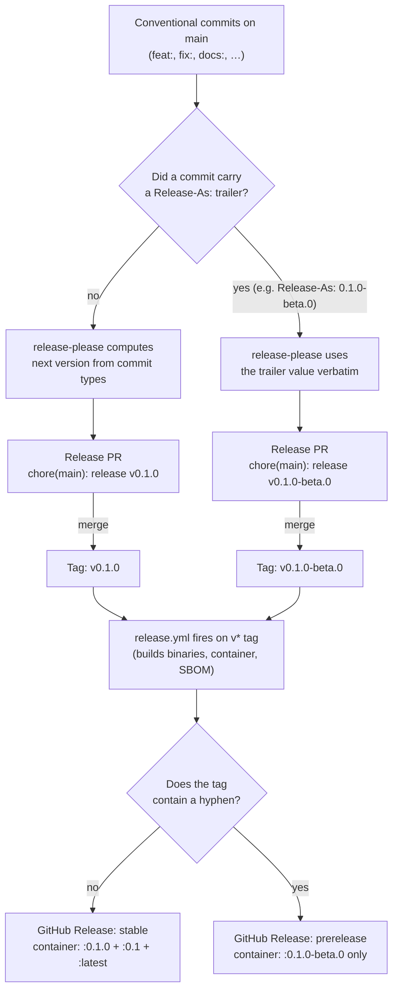

# Releases

Recall's releases are automated by [release-please](https://github.com/googleapis/release-please). **You should never need to run `git tag` by hand.** This document covers the whole flow: cutting stable releases and prereleases, the `make` shortcuts for the manual bits, and the recovery procedures when the automation gets stuck.

For background on commit conventions that drive release-please, see [CONTRIBUTING.md → Pre-commit hooks (lefthook)](CONTRIBUTING.md#pre-commit-hooks-lefthook).

## Table of contents

- [The happy path](#the-happy-path)
- [One-time repo setup](#one-time-repo-setup)
- [Cutting a stable release](#cutting-a-stable-release)
- [Cutting a prerelease (beta / rc / alpha)](#cutting-a-prerelease-beta--rc--alpha)
- [Version-bump rules](#version-bump-rules)
- [Stable vs. prerelease at a glance](#stable-vs-prerelease-at-a-glance)
- [When `release.yml` doesn't auto-fire](#when-releaseyml-doesnt-auto-fire)
- [Skipping or pausing release-please](#skipping-or-pausing-release-please)
- [Emergency manual tag (last resort)](#emergency-manual-tag-last-resort)

## The happy path

```
conventional commits on main
    ↓
release-please.yml opens "chore(main): release vX.Y.Z" PR
    ↓
maintainer reviews + merges the PR
    ↓
release-please creates the vX.Y.Z tag
    ↓
release.yml builds binaries + DMG + container image
    ↓
GitHub Release published with artifacts attached
```

Config lives in `release-please-config.json` and `.release-please-manifest.json`.

## One-time repo setup

Two settings unlock the full automation. Skip either and you'll fall back to the [manual recovery procedures](#when-releaseyml-doesnt-auto-fire).

1. **Allow GitHub Actions to open PRs.** Settings → Actions → General → Workflow permissions → check **"Allow GitHub Actions to create and approve pull requests"**. Without this, release-please errors with *"GitHub Actions is not permitted to create or approve pull requests."* when it tries to open the Release PR.

2. **`RELEASE_PLEASE_TOKEN` secret.** Create a fine-grained PAT scoped to this repo with `contents: write` + `pull-requests: write` (or use a GitHub App). Save it as the repo secret `RELEASE_PLEASE_TOKEN`.

   Why it matters: tags pushed by `GITHUB_TOKEN` do **not** fire downstream workflows (GitHub's anti-loop guard). With `RELEASE_PLEASE_TOKEN` set, the tag release-please creates is attributed to the PAT owner and `release.yml` fires automatically. Without it, you have to nudge `release.yml` manually for every cut — see [When `release.yml` doesn't auto-fire](#when-releaseyml-doesnt-auto-fire). `release-please.yml` already reads the secret (`token: ${{ secrets.RELEASE_PLEASE_TOKEN || secrets.GITHUB_TOKEN }}`); no code change needed once the secret is in place.

## Cutting a stable release

1. **Merge the Release PR.** release-please opens it titled `chore(main): release vX.Y.Z` whenever there are tag-bumping commits on `main`. The PR diff shows the version bump in `.release-please-manifest.json` and the additions to `CHANGELOG.md`.
2. **Review the changelog content** before merging — anything `chore:` or `style:` is hidden, anything else is grouped by type. If the changelog is missing a notable change, fix the underlying commit subject (amend + force-push, OR add an empty `git commit --allow-empty -m "fix: …"` if the original PR is already squashed in).
3. **Merge the PR** (squash). release-please creates the `vX.Y.Z` git tag on the merge commit.
4. **`release.yml` fires** and builds artifacts. Wait for `build-docker`, `build-mac`, `sbom`, `publish-container`, and `release` to go green — typically 8–15 minutes. **If no `Release` workflow run shows up at all**, see [When `release.yml` doesn't auto-fire](#when-releaseyml-doesnt-auto-fire).
5. **Verify the GitHub Release**: `.dmg`, `.tar.gz`, `.deb`, `.exe`, SBOM, and per-artifact `.sha256` files should all be attached. The container image at `ghcr.io/<owner>/recall-server:X.Y.Z` should be present in Packages, with the rolling `:X.Y` and `:latest` tags pointing at it. (Rolling tags only move on stable releases — see the [stable vs. prerelease table](#stable-vs-prerelease-at-a-glance).)

## Cutting a prerelease (beta / rc / alpha)

release-please respects a [`Release-As:` commit footer](https://github.com/googleapis/release-please/blob/main/docs/customizing.md#release-as) that overrides the version it would otherwise compute. The shortcut:

```sh
make release-beta VERSION=0.0.13-beta.0
git push origin main
```

`make release-beta` creates a signed empty commit with the `Release-As:` footer formatted correctly and reminds you of the push-and-fire steps. The expansion of what it does:

```sh
git commit -s --allow-empty -m "chore: cut v0.0.13-beta.0" -m "Release-As: 0.0.13-beta.0"
```

What happens next:

1. release-please re-evaluates on the push, reads the `Release-As:` footer, and opens (or updates) a **Release PR** titled `chore(main): release v0.0.13-beta.0`.
2. The PR diff bumps `.release-please-manifest.json` to `0.0.13-beta.0` and adds a `## [0.0.13-beta.0]` heading to `CHANGELOG.md` listing every commit since the last release tag.
3. Merge the PR. release-please creates the `v0.0.13-beta.0` git tag.
4. **If `RELEASE_PLEASE_TOKEN` is configured**, `release.yml` fires on the `v*` tag automatically. **Otherwise**, fire it yourself: `make release-fire TAG=v0.0.13-beta.0`. GitHub marks the resulting Release as a **prerelease** automatically because the tag has a hyphenated suffix — no separate workflow or flag needed. The published container is tagged `:0.0.13-beta.0` only; the rolling `:latest` and `:0.0` tags don't move, so production pulls of `:latest` continue to land on the most recent stable build.

The next beta in the same line: `make release-beta VERSION=0.0.13-beta.1`. The next *official* release: don't use `release-beta` — let release-please bump normally from the most recent tag (e.g. `v0.0.13` from `fix:` commits, `v0.1.0` from `feat:`). The absence of a hyphenated suffix in the tag is what makes a release "official"; the same `release.yml` builds artifacts either way.

**Force a specific stable version** (e.g. jumping from `v0.1.5` straight to `v1.0.0`): `make release-beta VERSION=1.0.0` works too — the target checks for the hyphen but lets you opt out with `ALLOW_STABLE=1`.

## Version-bump rules

release-please reads commit types since the last tag and bumps accordingly:

| Commit prefix | Pre-1.0 effect | Post-1.0 effect |
|---|---|---|
| `feat!:` or `BREAKING CHANGE:` footer | minor bump | **major** bump |
| `feat:` | minor bump | minor bump |
| `fix:`, `perf:` | patch bump | patch bump |
| `refactor:`, `docs:`, `test:`, `build:`, `ci:`, `revert:` | patch bump | patch bump |
| `chore:`, `style:` | no bump, hidden from changelog | same |

Until the project crosses `1.0.0`, breaking changes are minor bumps (per the `bump-minor-pre-major` flag in `release-please-config.json`). After 1.0.0, the strict SemVer rules apply.

## Stable vs. prerelease at a glance

Both stable releases and prereleases go through the same release-please → `v*` tag → `release.yml` pipeline. The only inputs that differ are (a) where the version number comes from and (b) whether the resulting tag carries a hyphenated suffix. `release.yml` keys off that suffix to decide what to publish and how to flag the GitHub Release.

| Stage | Stable `v0.1.0` | Prerelease `v0.1.0-beta.0` |
|---|---|---|
| Version source | computed from `feat:` / `fix:` commits since the last tag | `Release-As:` commit-message footer overrides |
| Maintainer command | merge release-please PR | `make release-beta VERSION=0.1.0-beta.0 && git push` |
| Release PR title | `chore(main): release v0.1.0` | `chore(main): release v0.1.0-beta.0` |
| `.release-please-manifest.json` value | `0.1.0` | `0.1.0-beta.0` |
| Git tag created on PR merge | `v0.1.0` | `v0.1.0-beta.0` (hyphenated suffix) |
| Workflow that fires on the tag | `release.yml` | **same** `release.yml` |
| Release artifact filenames | `recall-0.1.0-*.{tar.gz,deb,dmg,exe,zip}` + SBOM | `recall-0.1.0-beta.0-*.{tar.gz,deb,dmg,exe,zip}` + SBOM |
| Container tags (`ghcr.io/<owner>/recall-server`) | `:0.1.0`, `:0.1`, **and** `:latest` | `:0.1.0-beta.0` only (rolling `:latest` and `:0.1` don't move) |
| GitHub Release marker | normal release | **auto-flagged as prerelease** (the hyphen in `github.ref_name` is what flips `prerelease: true`) |



## When `release.yml` doesn't auto-fire

You merged a Release PR, the `vX.Y.Z` tag exists on origin (`git ls-remote --tags origin | grep vX.Y.Z`), but no `Release` workflow run appears under Actions. **This is expected when `release-please.yml` is using the default `GITHUB_TOKEN`** — GitHub deliberately suppresses workflow chaining for refs authored by `github-actions[bot]` (anti-loop guard), so the tag push doesn't fire `release.yml`'s `push: tags` trigger.

**Immediate unblock** — fire `release.yml` manually for the existing tag:

```sh
make release-fire TAG=v0.0.13-beta.0
```

Equivalent without `make`: `gh workflow run release.yml --ref v0.0.13-beta.0`, or from the Actions UI: Release → Run workflow → pick the tag in the "Use workflow from" dropdown.

Every job in `release.yml` keys off `github.ref_name`, which is the tag name for both `push: tags` and `workflow_dispatch`, so no other knobs to flip. The `workflow_dispatch:` trigger must exist in the workflow file *at the tag's ref* for this to work — tags cut before `workflow_dispatch:` was added (anything before `v0.0.12-beta.0`) can't be fired this way and need the [emergency manual tag](#emergency-manual-tag-last-resort) re-push instead.

**Long-term fix** — configure `RELEASE_PLEASE_TOKEN` per [One-time repo setup](#one-time-repo-setup). Future tags will be authored by the PAT owner and fire `release.yml` automatically.

## Skipping or pausing release-please

- **Empty Release PR**: if no `feat:` / `fix:` / etc. commits have landed since the last tag, no PR opens. Add at least one tag-bumping commit (or `chore:` if you genuinely just want a re-tag — that won't trigger a version bump but you can manually edit the manifest).
- **Pausing**: close the Release PR without merging. It will re-open on the next push to `main` with the latest changes folded in.

## Emergency manual tag (last resort)

Only do this if `release-please.yml` is broken or you need a hotfix tag before release-please catches up. The `release.yml` workflow fires on any `v*` tag pushed by a real user account.

```sh
git checkout main && git pull
git tag -a v0.1.1 -m "hotfix: …"
git push origin v0.1.1
```

After the manual tag, the next push to `main` will trigger release-please to reconcile `.release-please-manifest.json` against the new tag — you may see an unusual Release PR. Inspect it carefully before merging.
