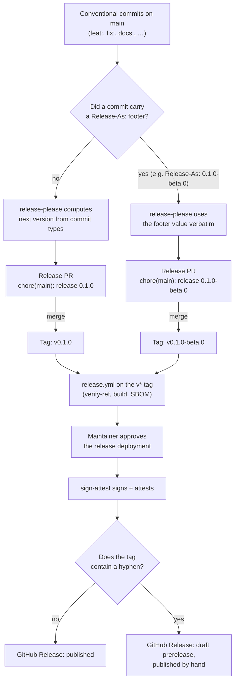

# Releases

Recall's releases are automated by [release-please](https://github.com/googleapis/release-please). **You should never need to run `git tag` by hand.** This document covers the whole flow: cutting stable releases and prereleases, approving the signing job, the signing key, the `task` shortcuts for the manual bits, and the recovery procedures when the automation gets stuck.

For background on commit conventions that drive release-please, see [CONTRIBUTING.md → Git hooks (lefthook)](CONTRIBUTING.md#git-hooks-lefthook).

## Table of contents

- [The happy path](#the-happy-path)
- [One-time repo setup](#one-time-repo-setup)
- [Cutting a stable release](#cutting-a-stable-release)
- [Approving a release](#approving-a-release)
- [Cutting a prerelease (beta / rc / alpha)](#cutting-a-prerelease-beta--rc--alpha)
- [Version-bump rules](#version-bump-rules)
- [Stable vs. prerelease at a glance](#stable-vs-prerelease-at-a-glance)
- [`release.yml` jobs](#releaseyml-jobs)
- [Update signing key](#update-signing-key)
- [The first signed release](#the-first-signed-release)
- [When `release.yml` doesn't auto-fire](#when-releaseyml-doesnt-auto-fire)
- [When a release is missing or incomplete](#when-a-release-is-missing-or-incomplete)
- [Skipping or pausing release-please](#skipping-or-pausing-release-please)
- [Emergency manual tag (last resort)](#emergency-manual-tag-last-resort)

## The happy path

```text
conventional commits on main
    ↓
release-please.yml (job release-please) opens the "chore(main): release X.Y.Z" PR
    ↓
maintainer reviews + merges the PR (rebase)
    ↓
release-please.yml (job tag-and-dispatch) checks the merge commit,
pushes the vX.Y.Z tag and dispatches release.yml
    ↓
release.yml: verify-ref → build-windows → sbom
    ↓
maintainer approves the `release` deployment in the Actions UI
    ↓
sign-attest signs, checksums and attests every asset
    ↓
release publishes them (a prerelease stays a draft for the maintainer to publish)
```

Recall ships a **Windows desktop app only**; the release pipeline publishes
Windows artifacts: the NSIS installer, the raw self-update exe, a `.sig`
signature for each of those two, the reference YAMLs that changed, the
`Reset-Database.bat` helper, an SBOM, a `.sha256` per file, the combined
`SHA256SUMS`, and the provenance bundle `recall-X.Y.Z.intoto.jsonl`. The
Linux/macOS desktop builds and the self-hosted server container were removed.

Config lives in `release-please-config.json` and `.release-please-manifest.json`.

## One-time repo setup

**Allow GitHub Actions to open PRs.** Settings → Actions → General → Workflow permissions → check **"Allow GitHub Actions to create and approve pull requests"**. Without this, release-please errors with *"GitHub Actions is not permitted to create or approve pull requests."* when it tries to open the Release PR. Skip it and you'll fall back to the [manual recovery procedures](#when-releaseyml-doesnt-auto-fire).

**The `release` environment.** Settings → Environments → `release`:

- **Required reviewers**: the maintainer. Leave **Prevent self-review** off: a run you dispatch yourself with `task release-fire` would otherwise have nobody who may approve it.
- **Administrator bypass off**, so an admin token cannot skip the approval.
- **Deployment branches and tags**: selected tags only, the pattern `v*`.
- **Environment secret** `RECALL_UPDATE_SIGNING_KEY`, set as described in [Update signing key](#update-signing-key). It must be an environment secret, never a repository or organization secret: only a job that names the environment, and only once approved, can read it.

`sign-attest` in `release.yml` is the only job that names this environment.

## Cutting a stable release

1. **Review the Release PR.** release-please opens it titled `chore(main): release X.Y.Z` whenever there are releasable commits on `main`. The PR diff shows the version bump in `.release-please-manifest.json` and the additions to `CHANGELOG.md`.
2. **Review the changelog content** before merging — anything `chore:` or `style:` is hidden, anything else is grouped by type. Commits already on `main` can't be reworded (it takes no force-push), so a misleading subject has to be caught in its own PR's review.
3. **Merge the PR** (rebase). `release-please.yml`'s `tag-and-dispatch` job runs on the merge commit. Its `scripts/release/push-release-tag.sh` refuses to tag unless the checkout is the pushed commit, any existing `vX.Y.Z` tag already points at it (a tag anywhere else fails as **tag squatting**), `scripts/release/verify-release-ref.sh` accepts it, and the commit is the merge of release-please's own PR (branch `release-please--branches--main`, opened by `github-actions[bot]`, titled for this version). Then it pushes the `vX.Y.Z` tag, calls `gh workflow run release.yml --ref vX.Y.Z`, and flips the PR label from `autorelease: pending` to `autorelease: tagged`.
4. **`release.yml` runs** `verify-ref`, `build-windows` and `sbom`, which take a few minutes, then `sign-attest` stops at **Waiting for review**. **If no `Release` workflow run shows up at all**, see [When `release.yml` doesn't auto-fire](#when-releaseyml-doesnt-auto-fire).
5. **Approve the deployment** after the checks in [Approving a release](#approving-a-release). `sign-attest` and `release` then finish in a few minutes.
6. **Verify the GitHub Release**: the NSIS `recall-X.Y.Z-windows-amd64-installer.exe` (human download), the raw `recall-X.Y.Z-windows-amd64.exe` (in-app updater target), a `.sig` for each of those two, the changed reference-data YAMLs, `recall-X.Y.Z-Reset-Database.bat`, the SBOM, per-file `.sha256` files, the combined `SHA256SUMS` and `recall-X.Y.Z.intoto.jsonl` should all be attached. `scripts/release/check-release-assets.sh` already refused anything missing or extra before publishing.

## Approving a release

Approval is the one human check between a tag and the signing key. Only the maintainer gives it, in the Actions UI; never approve through the API (`POST …/pending_deployments`), and never from an agent session.

**Before approving**, confirm the run is the release you merged:

- It is the **Release** workflow (`.github/workflows/release.yml`) for tag `vX.Y.Z`, started in one of three ways: by `workflow_dispatch` from `github-actions[bot]` (the normal path), by `workflow_dispatch` from you through `task release-fire`, or by the `push` of a tag you pushed yourself under [Emergency manual tag](#emergency-manual-tag-last-resort). `gh run` reports no actor, so the `gh api` line below shows who started it.
- Its commit is the `chore(main): release X.Y.Z` commit on `main`:

  ```sh
  gh run list --workflow release.yml --limit 3 --json databaseId,headBranch,headSha,event,status
  gh run view RUN_ID --json headSha,headBranch,event,jobs \
    --jq '{headSha, headBranch, event, jobs: [.jobs[] | "\(.name)=\(.conclusion)"]}'
  gh api repos/sound-barrier/recall/actions/runs/RUN_ID \
    --jq '{event, actor: .actor.login, triggering_actor: .triggering_actor.login}'
  git fetch origin main
  git log -1 --format=%s HEAD_SHA        # chore(main): release X.Y.Z
  git merge-base --is-ancestor HEAD_SHA origin/main && echo "on main"
  ```

- `verify-ref`, `build-windows` and `sbom` all succeeded.

**Then approve**: Actions → the Release run for `vX.Y.Z` → **Review deployments** → tick `release` → **Approve and deploy**. If anything above is off, choose **Reject** instead: a rejected run publishes nothing.

- A job not approved within **30 days** fails on its own. Start a fresh run with `task release-fire TAG=vX.Y.Z`.
- Re-running `sign-attest` (for example with **Re-run failed jobs**) asks for approval again. The `release` job names no environment, so re-running it alone does not.

## Cutting a prerelease (beta / rc / alpha)

release-please respects a [`Release-As:` commit footer](https://github.com/googleapis/release-please/blob/main/docs/customizing.md#release-as) that overrides the version it would otherwise compute. The footer has to reach `main` through a pull request, since `main` takes no direct pushes (administrators included). And because GitHub's **Rebase and merge** drops a commit that was empty to begin with, it has to ride a commit that changes a file: the last commit of a PR that is ready to merge works.

```text
fix(parser): accept the new rank banner

<why the change is needed>

Release-As: 0.0.13-beta.0
```

`task release-beta VERSION=0.0.13-beta.0` writes the footer correctly, but on an empty `chore: cut v0.0.13-beta.0` commit, which a rebase merge drops. Until the task is reworked, drop that commit straight away with `git reset --soft HEAD~1`, before you commit anything on top of it, and put its footer on a real commit instead. `git pull --rebase` keeps a commit that started empty, so leaving it would set your local `main` apart from `origin`.

What happens next:

1. release-please re-evaluates on the merge, reads the `Release-As:` footer, and opens (or updates) a **Release PR** titled `chore(main): release 0.0.13-beta.0`.
2. The PR diff bumps `.release-please-manifest.json` to `0.0.13-beta.0` and adds a `## [0.0.13-beta.0]` heading to `CHANGELOG.md` listing every commit since the last release tag.
3. Merge the PR. `tag-and-dispatch` runs the same checks as for a stable release, pushes the `v0.0.13-beta.0` tag, and calls `gh workflow run release.yml --ref v0.0.13-beta.0`. (The explicit `gh workflow run` is required because tag pushes from `github-actions[bot]` don't fire `release.yml`'s `push: tags` trigger on their own — see the [auto-fire section](#when-releaseyml-doesnt-auto-fire) for the why.)
4. [Approve the deployment](#approving-a-release) exactly as for a stable release.
5. The `release` job publishes the prerelease as a **draft** with every asset attached. Releases here are immutable, so GitHub takes no uploads once a release is published, and the release action creates a prerelease already published unless it keeps a draft. Review the draft on the Releases page, then **Publish release** yourself. GitHub marks it a **prerelease** because the tag has a hyphenated suffix.

Installed copies of Recall never see a prerelease: the updater asks GitHub for the latest release, which excludes prereleases and drafts. The roster staging step diffs against the previous **stable** tag for the same reason, since the app's roster walk-back cannot see a draft that may never be published.

The next beta in the same line: another `Release-As: 0.0.13-beta.1` footer. The next *official* release needs a footer too: release-please keeps the prerelease suffix whenever it bumps a version, so after `0.0.13-beta.1` a `fix:` or `feat:` commit gets a Release PR for `0.0.14-beta.1`, not `0.0.13`. Land `Release-As: 0.0.13` through a PR the same way; once the manifest holds a stable version, release-please bumps normally again. The absence of a hyphenated suffix in the tag is what makes a release "official"; the same `release.yml` builds artifacts either way.

**Force a specific stable version** (e.g. jumping from `v0.1.5` straight to `v1.0.0`): a `Release-As: 1.0.0` footer, landed through a PR the same way.

## Version-bump rules

release-please reads commit types since the last tag and bumps accordingly:

| Commit prefix | Pre-1.0 effect | Post-1.0 effect |
|---|---|---|
| `feat!:` or `BREAKING CHANGE:` footer | minor bump | **major** bump |
| `feat:` | patch bump | minor bump |
| `fix:`, `perf:` | patch bump | patch bump |
| `refactor:`, `docs:`, `test:`, `build:`, `ci:`, `revert:` | patch bump | patch bump |
| `chore:`, `style:` | no bump, hidden from changelog | same |

Until the project crosses `1.0.0`, breaking changes are minor bumps and features are patch bumps (the `bump-minor-pre-major` and `bump-patch-for-minor-pre-major` flags in `release-please-config.json`). After 1.0.0, the strict SemVer rules apply.

## Stable vs. prerelease at a glance

Both stable releases and prereleases go through the same release-please → `v*` tag → `release.yml` pipeline, and both wait for the same approval. The only inputs that differ are (a) where the version number comes from and (b) whether the resulting tag carries a hyphenated suffix. `release.yml` keys off that suffix to decide how to flag the GitHub Release and whether to leave it a draft.

| Stage | Stable `v0.1.0` | Prerelease `v0.1.0-beta.0` |
|---|---|---|
| Version source | computed from `feat:` / `fix:` commits since the last tag, or a `Release-As:` footer when the last release was a prerelease | `Release-As:` commit-message footer overrides |
| Maintainer steps | merge the Release PR, approve the deployment | land the `Release-As:` footer through a PR, merge the Release PR, approve the deployment, publish the draft |
| Release PR title | `chore(main): release 0.1.0` | `chore(main): release 0.1.0-beta.0` |
| `.release-please-manifest.json` value | `0.1.0` | `0.1.0-beta.0` |
| Git tag created on PR merge | `v0.1.0` | `v0.1.0-beta.0` (hyphenated suffix) |
| Workflow that fires on the tag | `release.yml` | **same** `release.yml` |
| Release artifact filenames | `recall-0.1.0-windows-amd64*.exe` + `.sig` + YAMLs + `SHA256SUMS` + SBOM + `recall-0.1.0.intoto.jsonl` | `recall-0.1.0-beta.0-windows-amd64*.exe` + `.sig` + YAMLs + `SHA256SUMS` + SBOM + `recall-0.1.0-beta.0.intoto.jsonl` |
| GitHub Release | published once approved | **draft prerelease** you publish by hand (the hyphen in `github.ref_name` sets both `prerelease` and `draft`) |


```mermaid
flowchart TD
    A["Conventional commits on main<br/>(feat:, fix:, docs:, …)"] --> B{"Did a commit carry<br/>a Release-As: footer?"}
    B -- "no" --> C["release-please computes<br/>next version from commit types"]
    B -- "yes (e.g. Release-As: 0.1.0-beta.0)" --> D["release-please uses<br/>the footer value verbatim"]
    C --> E["Release PR<br/>chore(main): release 0.1.0"]
    D --> F["Release PR<br/>chore(main): release 0.1.0-beta.0"]
    E -- "merge" --> G["Tag: v0.1.0"]
    F -- "merge" --> H["Tag: v0.1.0-beta.0"]
    G --> I["release.yml on the v* tag<br/>(verify-ref, build, SBOM)"]
    H --> I
    I --> M["Maintainer approves<br/>the release deployment"]
    M --> N["sign-attest signs + attests"]
    N --> J{"Does the tag<br/>contain a hyphen?"}
    J -- "no" --> K["GitHub Release: published"]
    J -- "yes" --> L["GitHub Release: draft prerelease,<br/>published by hand"]
```

## `release.yml` jobs

Triggered on `v*` tag push and on `workflow_dispatch` (the path `push-release-tag.sh` and `task release-fire` use). Every job keys off `github.ref_name` (the tag name) so both triggers produce identical artifacts. Workflow-level `concurrency: { group: release-${{ github.ref_name }}, cancel-in-progress: false }` serializes duplicate runs against the same tag — important because `softprops/action-gh-release` is non-idempotent. Every job that downloads another job's files first checks them against the SHA-256 digests the producing job recorded as a job output (`scripts/release/verify-asset-digests.sh`), since `sign-attest` can wait days for approval and an artifact can be replaced under its name in the meantime.

| Job | `needs:` | Output | Notes |
|---|---|---|---|
| `verify-ref` | — | nothing | `scripts/release/verify-release-ref.sh` refuses the run unless it is on a tag of the form `vX.Y.Z[-prerelease]`, the tag points at the checked-out commit, `.release-please-manifest.json` at that commit names the version, the commit's subject is `chore(main): release X.Y.Z`, and the commit is on `main`. It catches a mistaken or stray tag, not a deliberate one: a tag on a commit that edits the workflow or the script runs the edited copies, which is why the approval checks the commit. |
| `build-windows` | `verify-ref` | NSIS `installer.exe` + raw `recall-X.Y.Z-windows-amd64.exe` (artifact `build-wails-windows`), their digests | `contents: read` and no OIDC token, so the build can neither publish nor attest. `wails-build-env` with `cache: 'false'` installs the tools fresh from `mise.lock`, never from a cache another run saved. **Native** cross-compile on ubuntu — v3's WebView2 loader is pure Go (`CGO_ENABLED=0`), so no Docker/mingw. `task build-windows` = `wails3 task windows:package INSTALL_SCOPE=user` (generate syso → `go build -H windowsgui` → WebView2 bootstrapper → `makensis`; per-user install so the in-app updater can swap in place), then `scripts/release/package-wails-windows.sh` emits both the installer (human download) and the raw exe (updater target). |
| `sbom` | `build-windows` | `recall-X.Y.Z-sbom.spdx.json` (artifact `sbom`), its digest | Verifies the build digests, then `anchore/sbom-action` scans the source AND the built binaries, catching Go-build-info indirect deps a source-only scan misses. |
| `sign-attest` | `build-windows`, `sbom` | every release asset (artifact `release-assets`), their digests | The only job with `environment: release`, so the only one that waits for approval and can read `RECALL_UPDATE_SIGNING_KEY`; also the only one with `id-token: write` + `attestations: write`. It runs first-party actions and repository code only. Builds `cmd/update-signing` with `setup-go` `cache: false` and `GOTOOLCHAIN=local GOPROXY=off GOFLAGS=-mod=readonly`; verifies the downloaded digests and file names; stages the roster YAMLs that changed since the previous stable tag and `Reset-Database.bat`; signs the exe and the installer with the key in that one step's environment; verifies both signatures in a separate step without the key; writes the per-file `.sha256` files and `SHA256SUMS` (`scripts/release/compute-sha256.sh`); makes one provenance attestation over the exes, `.sig` files, YAMLs, `.bat`, SBOM and checksums; copies its Sigstore bundle to `recall-X.Y.Z.intoto.jsonl`; and runs `scripts/release/check-release-assets.sh`, which refuses a missing asset or a stray file. |
| `release` | `sign-attest` | the GitHub Release | `contents: write` only, and no environment, so it needs no second approval. Verifies the asset digests, then `softprops/action-gh-release` publishes every file in `release-assets/` in one call (`fail_on_unmatched_files: true`). A prerelease stays a draft. |

**Load-bearing names.** The in-app updater looks assets up by name, so renaming any of these breaks every shipped client: `SHA256SUMS` (the Wails github provider's `ChecksumAsset`, a compile-time constant), the exe name `recall-X.Y.Z-windows-amd64.exe` (the updater refuses an exe not named for its release), and `recall-X.Y.Z-windows-amd64.exe.sig` beside it. A release without a valid `.sig` is refused by every copy of Recall from the first signed release on, and because releases are immutable the fix is a new patch release, never a re-upload.

## Update signing key

### What it signs

Each `.sig` file holds a raw 64-byte Ed25519 signature over `recall-update-signature-v1`, a newline, the asset's base name, a newline, and the asset's raw 32-byte SHA-256. `sign-attest` signs the updater exe and the installer. The public key is `pkg/updatesig/public_key.pem`, compiled into every build; the SHA-256 of its DER encoding is pinned in `pkg/updatesig/keys_test.go` and published in [SECURITY.md](SECURITY.md). The secret `RECALL_UPDATE_SIGNING_KEY` holds the private key as one line of base64 (the 32-byte seed). `task update-signing -- keygen | sign | verify` runs the tool, `cmd/update-signing`.

### Custody

The key already exists: `pkg/updatesig/public_key.pem` is its public half, pinned by fingerprint in `pkg/updatesig/keys_test.go` and SECURITY.md. Set or restore the environment secret from the escrow copy (the `gh secret set` step below). Run `keygen` only to [rotate](#rotation) the key, since it overwrites the pinned public key.

- **Generate a key in your own terminal** — never in CI, never in an agent session — with an absolute `-out` path in an existing directory outside every git work tree (the tool refuses anything else, and never overwrites a file):

  ```sh
  task update-signing -- keygen -out /absolute/path/update-signing.key > pkg/updatesig/public_key.pem
  ```

  A refused run generates no key, but the shell has already emptied `public_key.pem`; `git checkout pkg/updatesig/public_key.pem` restores it.

- **Escrow** the one line in the key file, then confirm that a restored copy matches the file byte for byte. GitHub never shows a secret again, so the escrow copy is the only one you can ever restore.
- **Set the environment secret** and confirm where it landed:

  ```sh
  gh secret set RECALL_UPDATE_SIGNING_KEY --env release --repo sound-barrier/recall < /absolute/path/update-signing.key
  gh secret list --env release --repo sound-barrier/recall   # listed here
  gh secret list --repo sound-barrier/recall                 # and not here
  ```

- **Delete the local key file** once escrow and the secret are both confirmed.
- Claude never generates the key, never reads or sets the secret, and never approves a deployment (see CLAUDE.md).

### When signing fails

A missing secret fails the **Sign the updater exe and installer** step with `RECALL_UPDATE_SIGNING_KEY is not set`, and a secret that is not the pinned key fails it with `signing key is not the key pinned in pkg/updatesig/public_key.pem`. Either way nothing is published. Fix the secret, then **Re-run failed jobs** on the run and approve again.

### Rotation

Recall pins one key, and a copy of Recall accepts only signatures from the key compiled into it. Rotating therefore needs a bridge release that **embeds the new public key but is signed with the old private key**, so the copies it updates still accept it; the release after it is signed with the new key. Today the signer refuses a key other than the one pinned at the tagged commit, so a bridge release needs a one-off change to `sign-attest` first. For the bridge: generate the new key as above, update `pkg/updatesig/public_key.pem`, the fingerprint in `pkg/updatesig/keys_test.go` and the copies in SECURITY.md and `docs/install-windows.md`, and switch the environment secret to the new key only after the bridge release ships.

Until the first signed release ships, no stable release embeds the key, so replacing it needs no bridge release: update those files and the environment secret together.

### Loss or compromise

- **Lost key** (no secret and no escrow copy): no future release can carry a signature installed copies accept. Every copy from the first signed release on can no longer update itself; users have to download and install the next release by hand. Say so in its release notes.
- **Suspected theft**: delete the environment secret (`gh secret delete RECALL_UPDATE_SIGNING_KEY --env release --repo sound-barrier/recall`), stop releasing, and publish a security advisory. Installed copies trust the stolen key until they are reinstalled from a release that embeds a new one, so the advisory has to tell users to install that release by hand and not to accept in-app updates until then.

## The first signed release

- Copies of Recall older than the first release published with `.sig` files update to it with the `SHA256SUMS` check alone, and with no check at all if `SHA256SUMS` were missing. A stable release publishes as soon as `sign-attest` finishes, with no draft to hold it, so rehearse on a prerelease first (below) and run the same checks on the stable release's assets as soon as it publishes. A published release can't be changed, so a failure there means fixing forward, as in [When a release is missing or incomplete](#when-a-release-is-missing-or-incomplete).
- From that release on, installed copies refuse any release without a valid `.sig`.
- **Rehearse on a prerelease first.** Put `Release-As: X.Y.Z-rc.0` on a commit as in [Cutting a prerelease](#cutting-a-prerelease-beta--rc--alpha) and take it through the whole flow: the `tag-and-dispatch` checks, the approval, `sign-attest`, and the draft. Installed copies never see a prerelease, so nothing reaches users. Before publishing the draft, check its assets from a clone of this repository:

  ```sh
  v=X.Y.Z-rc.0
  dir="$PWD/tmp/release-v$v"
  gh release download "v$v" --repo sound-barrier/recall --dir "$dir"
  (cd "$dir" && sha256sum --check SHA256SUMS)
  for f in "recall-$v-windows-amd64.exe" "recall-$v-windows-amd64-installer.exe" "recall-$v-sbom.spdx.json"; do
    gh attestation verify "$dir/$f" --bundle "$dir/recall-$v.intoto.jsonl" --repo sound-barrier/recall \
      --signer-workflow sound-barrier/recall/.github/workflows/release.yml --source-ref "refs/tags/v$v"
  done
  task update-signing -- verify "$dir/recall-$v-windows-amd64.exe" "$dir/recall-$v-windows-amd64-installer.exe"
  ```

  `update-signing verify` prints `OK FILE` for each file that verifies against the pinned key.
- Then put `Release-As: X.Y.Z` on a commit and cut the stable release the same way; without that footer, release-please would follow the rc with another rc, such as `X.Y.(Z+1)-rc.0`. Once the release after it ships, a real in-app update on Windows between the two is the first live test of the signature check.

## When `release.yml` doesn't auto-fire

You merged a Release PR, the `vX.Y.Z` tag exists on origin (`git ls-remote --tags origin vX.Y.Z`), but no `Release` workflow run appears under Actions.

**Background** — tag pushes from `github-actions[bot]` (which the workflow's `GITHUB_TOKEN` auth surfaces us as) do NOT fire downstream workflows on their own; GitHub deliberately suppresses workflow chaining for bot-authored refs (anti-loop guard). The normal flow sidesteps this by having the `tag-and-dispatch` job's `push-release-tag.sh` call `gh workflow run release.yml --ref vX.Y.Z` immediately after the tag push. If that explicit dispatch failed (network blip, transient API error, missing `actions: write` permission), the tag exists but `release.yml` was never invoked.

**Immediate unblock** — fire `release.yml` manually for the existing tag:

```sh
task release-fire TAG=v0.0.13-beta.0
```

`scripts/release/fire-release.sh` refuses a tag name git would read as a pattern, fetches origin's tag and `main`, and dispatches only if `verify-release-ref.sh` accepts the tag, so it never starts a release that `verify-ref` would refuse. It then prints the approval steps. `gh workflow run release.yml --ref vX.Y.Z` or the Actions UI (Release → Run workflow → pick the tag in the "Use workflow from" dropdown) also work, but skip that local check.

Every job in `release.yml` keys off `github.ref_name`, which is the tag name for both `push: tags` and `workflow_dispatch`, so no other knobs to flip. The `workflow_dispatch:` trigger must exist in the workflow file *at the tag's ref* for this to work — tags cut before `workflow_dispatch:` was added (anything before `v0.0.12-beta.0`) can't be fired this way.

**Diagnose the auto-dispatch failure** — open the most recent `release-please.yml` run on `main` and its `tag-and-dispatch` job. The **Push tag for merged release-please PR** step's log shows one of:

- `Triggered release.yml for vX.Y.Z; it waits for approval of the release environment.` — the dispatch worked; look for the run, which may be waiting for approval.
- `Tag vX.Y.Z already points at …; not pushing or dispatching again.` — a re-run found its own tag; if no Release run exists, use `task release-fire`.
- **Tag squatting** — `vX.Y.Z` already exists at a different commit, so nothing was pushed or dispatched. Find out who pushed that tag and why before anything else.
- `no merged release PR from release-please--branches--main …` — the commit did not come from release-please's PR, or the API was slow; re-run the job once, and otherwise find out how that commit reached `main`.
- a `gh workflow run` error explaining what went wrong (auth, permission, or rate limit).

## When a release is missing or incomplete

`release.yml` publishes in one call at the very end, after `sign-attest` has checked the full asset set, so most failures leave no GitHub Release at all.

- **No release** — `verify-ref`, `build-windows`, `sbom` or `sign-attest` failed, or the approval was rejected or expired, so `release` never ran. Fix the cause, then **Re-run failed jobs** (a re-run of `sign-attest` waits for approval again), or start a fresh run with `task release-fire TAG=vX.Y.Z`.
- **A draft with missing assets** — the `release` job failed partway. A draft is not immutable: delete it with `gh release delete vX.Y.Z --yes` (the tag stays), then **Re-run failed jobs**; `release` publishes exactly what `sign-attest` recorded.
- **A published release that is wrong** — releases here are immutable: its assets and tag can't change, and deleting it retires the tag name for good. Fix forward with the next patch release.
- **No tag** (the Release PR merged but `tag-and-dispatch` never tagged) — tag the release commit yourself, as in [Emergency manual tag](#emergency-manual-tag-last-resort).

## Skipping or pausing release-please

- **Empty Release PR**: if no `feat:` / `fix:` / etc. commits have landed since the last tag, no PR opens. Add at least one tag-bumping commit (or `chore:` if you genuinely just want a re-tag — that won't trigger a version bump but you can manually edit the manifest).
- **Pausing**: close the Release PR without merging. It will re-open on the next push to `main` with the latest changes folded in.

## Emergency manual tag (last resort)

Only do this if `tag-and-dispatch` is broken. `verify-ref` releases nothing but a `chore(main): release X.Y.Z` commit on `main` whose `.release-please-manifest.json` reads `X.Y.Z`, so a manual tag goes on that commit, never on an arbitrary hotfix:

```sh
git fetch origin main
SHA=$(git log origin/main -1 --format=%H --grep='^chore(main): release 0.1.1$')
git tag v0.1.1 "$SHA"
git push origin v0.1.1
```

A tag you push yourself fires `release.yml`'s `push: tags` trigger (GitHub only suppresses that for tags pushed with `GITHUB_TOKEN`); if no run appears, use `task release-fire TAG=v0.1.1`. Approve the deployment as usual. Then flip the Release PR's label, which `push-release-tag.sh` would have done — release-please refuses to open a new Release PR while a merged one still reads `autorelease: pending`:

```sh
gh pr edit PR_NUMBER --remove-label "autorelease: pending" --add-label "autorelease: tagged"
```

A tag name whose immutable release was ever published and then deleted can't be used again.
