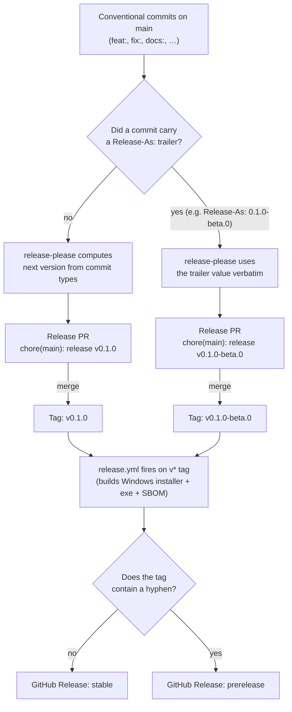

# Releases

Recall's releases are automated by [release-please](https://github.com/googleapis/release-please). **You should never need to run `git tag` by hand.** This document covers the whole flow: cutting stable releases and prereleases, the `make` shortcuts for the manual bits, and the recovery procedures when the automation gets stuck.

For background on commit conventions that drive release-please, see [CONTRIBUTING.md → Pre-commit hooks (lefthook)](CONTRIBUTING.md#git-hooks-lefthook).

## Table of contents

- [The happy path](#the-happy-path)
- [One-time repo setup](#one-time-repo-setup)
- [Cutting a stable release](#cutting-a-stable-release)
- [Cutting a prerelease (beta / rc / alpha)](#cutting-a-prerelease-beta--rc--alpha)
- [Version-bump rules](#version-bump-rules)
- [Stable vs. prerelease at a glance](#stable-vs-prerelease-at-a-glance)
- [`release.yml` jobs](#releaseyml-jobs)
- [When `release.yml` doesn't auto-fire](#when-releaseyml-doesnt-auto-fire)
- [When a release published with no assets](#when-a-release-published-with-no-assets)
- [Skipping or pausing release-please](#skipping-or-pausing-release-please)
- [Emergency manual tag (last resort)](#emergency-manual-tag-last-resort)

## The happy path

```text
conventional commits on main
    ↓
release-please.yml opens "chore(main): release vX.Y.Z" PR
    ↓
maintainer reviews + merges the PR
    ↓
release-please.yml fires again on the merge commit;
push-release-tag.sh pushes the vX.Y.Z tag and dispatches release.yml
    ↓
release.yml builds the Windows installer + raw updater exe + SHA256SUMS
    ↓
GitHub Release published with artifacts attached
```

Recall ships a **Windows desktop app only**; the release pipeline publishes
Windows artifacts (the NSIS installer, the raw self-update exe, the reference
YAMLs, an SBOM, and `SHA256SUMS`). The Linux/macOS desktop builds and the
self-hosted server container were removed.

Config lives in `release-please-config.json` and `.release-please-manifest.json`.

## One-time repo setup

**Allow GitHub Actions to open PRs.** Settings → Actions → General → Workflow permissions → check **"Allow GitHub Actions to create and approve pull requests"**. Without this, release-please errors with *"GitHub Actions is not permitted to create or approve pull requests."* when it tries to open the Release PR. Skip it and you'll fall back to the [manual recovery procedures](#when-releaseyml-doesnt-auto-fire).

## Cutting a stable release

1. **Merge the Release PR.** release-please opens it titled `chore(main): release vX.Y.Z` whenever there are tag-bumping commits on `main`. The PR diff shows the version bump in `.release-please-manifest.json` and the additions to `CHANGELOG.md`.
2. **Review the changelog content** before merging — anything `chore:` or `style:` is hidden, anything else is grouped by type. If the changelog is missing a notable change, fix the underlying commit subject (amend + force-push, OR add an empty `git commit --allow-empty -m "fix: …"` if the original PR is already squashed in).
3. **Merge the PR** (rebase). `release-please.yml` fires again on the merge commit; its `push-release-tag.sh` step detects the `chore(main): release X.Y.Z` subject, pushes the `vX.Y.Z` tag, calls `gh workflow run release.yml --ref vX.Y.Z` to fire the release workflow, and flips the PR label from `autorelease: pending` to `autorelease: tagged`.
4. **`release.yml` runs** and builds artifacts. `build-windows` (native NSIS cross-compile) runs first; `sbom` waits on it, and `release` waits on `sbom`. Total wall-clock is **~4–5 minutes** end-to-end, dominated by the Windows build (frontend bundle + `wails3` package + `makensis`). **If no `Release` workflow run shows up at all**, see [When `release.yml` doesn't auto-fire](#when-releaseyml-doesnt-auto-fire).
5. **Verify the GitHub Release**: the NSIS `recall-{v}-windows-amd64-installer.exe` (human download), the raw `recall-{v}-windows-amd64.exe` (in-app updater target), the reference-data YAMLs, `recall-{v}-Reset-Database.bat`, the SBOM, per-artifact `.sha256` files, and the combined `SHA256SUMS` should all be attached.

## Cutting a prerelease (beta / rc / alpha)

release-please respects a [`Release-As:` commit footer](https://github.com/googleapis/release-please/blob/main/docs/customizing.md#release-as) that overrides the version it would otherwise compute. The shortcut:

```sh
task release-beta VERSION=0.0.13-beta.0
git push origin main
```

`task release-beta` creates a signed empty commit with the `Release-As:` footer formatted correctly and reminds you of the push-and-fire steps. The expansion of what it does:

```sh
git commit -s --allow-empty -m "chore: cut v0.0.13-beta.0" -m "Release-As: 0.0.13-beta.0"
```

What happens next:

1. release-please re-evaluates on the push, reads the `Release-As:` footer, and opens (or updates) a **Release PR** titled `chore(main): release v0.0.13-beta.0`.
2. The PR diff bumps `.release-please-manifest.json` to `0.0.13-beta.0` and adds a `## [0.0.13-beta.0]` heading to `CHANGELOG.md` listing every commit since the last release tag.
3. Merge the PR. `release-please.yml`'s `push-release-tag.sh` step detects the `chore(main): release X.Y.Z` merge commit, pushes the `v0.0.13-beta.0` tag, and calls `gh workflow run release.yml --ref v0.0.13-beta.0` to fire the release workflow. (The explicit `gh workflow run` is required because tag pushes from `github-actions[bot]` don't fire `release.yml`'s `push: tags` trigger on their own — see the [auto-fire section](#when-releaseyml-doesnt-auto-fire) for the why.)
4. `release.yml` builds artifacts and creates the Release page. GitHub marks the resulting Release as a **prerelease** automatically because the tag has a hyphenated suffix — no separate workflow or flag needed.

The next beta in the same line: `task release-beta VERSION=0.0.13-beta.1`. The next *official* release: don't use `release-beta` — let release-please bump normally from the most recent tag (e.g. `v0.0.13` from `fix:` commits, `v0.1.0` from `feat:`). The absence of a hyphenated suffix in the tag is what makes a release "official"; the same `release.yml` builds artifacts either way.

**Force a specific stable version** (e.g. jumping from `v0.1.5` straight to `v1.0.0`): `task release-beta VERSION=1.0.0` works too — the target checks for the hyphen but lets you opt out with `ALLOW_STABLE=1`.

## Version-bump rules

release-please reads commit types since the last tag and bumps accordingly:

| Commit prefix | Pre-1.0 effect | Post-1.0 effect |
|---|---|---|
| `feat!:` or `BREAKING CHANGE:` footer | minor bump | **major** bump |
| `feat:` | minor bump | minor bump |
| `fix:`, `perf:` | patch bump | patch bump |
| `refactor:`, `docs:`, `test:`, `build:`, `ci:`, `revert:` | patch bump | patch bump |
| `chore:`, `style:` | no bump, hidden from changelog | same |

Until the project crosses `1.0.0`, breaking changes are minor bumps (per the `bump-minor-pre-major` flag in `release-please-config.json`). After 1.0.0, the strict SemVer rules apply.

## Stable vs. prerelease at a glance

Both stable releases and prereleases go through the same release-please → `v*` tag → `release.yml` pipeline. The only inputs that differ are (a) where the version number comes from and (b) whether the resulting tag carries a hyphenated suffix. `release.yml` keys off that suffix to decide what to publish and how to flag the GitHub Release.

| Stage | Stable `v0.1.0` | Prerelease `v0.1.0-beta.0` |
|---|---|---|
| Version source | computed from `feat:` / `fix:` commits since the last tag | `Release-As:` commit-message footer overrides |
| Maintainer command | merge release-please PR | `task release-beta VERSION=0.1.0-beta.0 && git push` |
| Release PR title | `chore(main): release v0.1.0` | `chore(main): release v0.1.0-beta.0` |
| `.release-please-manifest.json` value | `0.1.0` | `0.1.0-beta.0` |
| Git tag created on PR merge | `v0.1.0` | `v0.1.0-beta.0` (hyphenated suffix) |
| Workflow that fires on the tag | `release.yml` | **same** `release.yml` |
| Release artifact filenames | `recall-0.1.0-windows-amd64*.exe` + YAMLs + `SHA256SUMS` + SBOM | `recall-0.1.0-beta.0-windows-amd64*.exe` + YAMLs + `SHA256SUMS` + SBOM |
| GitHub Release marker | normal release | **auto-flagged as prerelease** (the hyphen in `github.ref_name` is what flips `prerelease: true`) |


```mermaid
flowchart TD
    A["Conventional commits on main<br/>(feat:, fix:, docs:, …)"] --> B{"Did a commit carry<br/>a Release-As: trailer?"}
    B -- "no" --> C["release-please computes<br/>next version from commit types"]
    B -- "yes (e.g. Release-As: 0.1.0-beta.0)" --> D["release-please uses<br/>the trailer value verbatim"]
    C --> E["Release PR<br/>chore(main): release v0.1.0"]
    D --> F["Release PR<br/>chore(main): release v0.1.0-beta.0"]
    E -- "merge" --> G["Tag: v0.1.0"]
    F -- "merge" --> H["Tag: v0.1.0-beta.0"]
    G --> I["release.yml fires on v* tag<br/>(builds Windows installer + exe + SBOM)"]
    H --> I
    I --> J{"Does the tag<br/>contain a hyphen?"}
    J -- "no" --> K["GitHub Release: stable"]
    J -- "yes" --> L["GitHub Release: prerelease"]
```

## `release.yml` jobs

Triggered on `v*` tag push (the auto-fire path from `push-release-tag.sh`'s `gh workflow run`) and on `workflow_dispatch` (manual fallback, same path the script uses). Every job keys off `github.ref_name` (the tag name) so both triggers produce identical artifacts. Workflow-level `concurrency: { group: release-${{ github.ref_name }}, cancel-in-progress: false }` serializes duplicate runs against the same tag — important because `softprops/action-gh-release` is non-idempotent.

| Job | `needs:` | Output | Notes |
|---|---|---|---|
| `build-windows` | — | Windows/amd64 NSIS `installer.exe` + raw `recall-{v}-windows-amd64.exe` | **Native** cross-compile on ubuntu — v3's WebView2 loader is pure Go (`CGO_ENABLED=0`), so no Docker/mingw. `task build-windows` = `wails3 task windows:package INSTALL_SCOPE=user` (generate syso → `go build -H windowsgui` → WebView2 bootstrapper → `makensis`; per-user install so the in-app updater can swap in place), then `scripts/release/package-wails-windows.sh` emits both the installer (human download) and the raw exe (updater target). Provenance-attested in-job. |
| `sbom` | `build-windows` | `recall-{version}-sbom.spdx.json` | `anchore/sbom-action`. Downloads the built artifacts so syft scans both source AND the binary. Captures Go-build-info indirect deps the source-only scan misses. |
| `release` | `build-windows`, `sbom` | GitHub Release with all artifacts + per-artifact `<filename>.sha256` + a combined `SHA256SUMS` | `softprops/action-gh-release` creates+uploads atomically — no pre-existing release means no GitHub-immutability race. This job also stages + attests the reference-data YAMLs and `Reset-Database.bat`. SBOM does not get a sha256 sidecar. Artifact filenames embed the version with the `v` prefix stripped. **`SHA256SUMS` is load-bearing**: the in-app Wails updater reads it (github provider `ChecksumAsset: "SHA256SUMS"`, a compile-time constant) to verify each download — renaming it breaks every shipped client. |

## When `release.yml` doesn't auto-fire

You merged a Release PR, the `vX.Y.Z` tag exists on origin (`git ls-remote --tags origin | grep vX.Y.Z`), but no `Release` workflow run appears under Actions.

**Background** — tag pushes from `github-actions[bot]` (which the workflow's `GITHUB_TOKEN` auth surfaces us as) do NOT fire downstream workflows on their own; GitHub deliberately suppresses workflow chaining for bot-authored refs (anti-loop guard). The normal flow sidesteps this by having `release-please.yml`'s `push-release-tag.sh` call `gh workflow run release.yml --ref vX.Y.Z` immediately after the tag push. If that explicit dispatch step failed (network blip, transient API error, missing `actions: write` permission), the tag exists but `release.yml` was never invoked.

**Immediate unblock** — fire `release.yml` manually for the existing tag:

```sh
task release-fire TAG=v0.0.13-beta.0
```

Equivalent without `make`: `gh workflow run release.yml --ref v0.0.13-beta.0`, or from the Actions UI: Release → Run workflow → pick the tag in the "Use workflow from" dropdown.

Every job in `release.yml` keys off `github.ref_name`, which is the tag name for both `push: tags` and `workflow_dispatch`, so no other knobs to flip. The `workflow_dispatch:` trigger must exist in the workflow file *at the tag's ref* for this to work — tags cut before `workflow_dispatch:` was added (anything before `v0.0.12-beta.0`) can't be fired this way and need the [emergency manual tag](#emergency-manual-tag-last-resort) re-push instead.

**Diagnose the auto-dispatch failure** — check the most recent `release-please.yml` run on `main`. The `Push tag for merged release-please PR` step's log will show either `Triggered release.yml for vX.Y.Z` (success — re-run via the immediate-unblock command above) or a `gh workflow run` error explaining what went wrong (auth, permission, or rate limit).

## When a release published with no assets

You see a `vX.Y.Z` release on the Releases page (or in Drafts) with **zero assets attached** (no `.exe`, no `.sha256` files). Two distinct causes have produced this end-state historically — the recovery differs by cause.

### Cause A — immutable-release race (pre `skip-github-release`)

Symptom: `release.yml` ran but the `release` job failed with:

```text
Cannot upload asset recall-…  to an immutable release.
GitHub only allows asset uploads before a release is published,
so upload assets to a draft release before you publish it.
```

Historically release-please created the GitHub Release itself as **published** the moment it pushed the tag, and `release.yml`'s `softprops/action-gh-release` lost a race against GitHub's "immutable once published" check on the first asset upload. The current config (`release-please-config.json` `packages."." → "skip-github-release": true`) makes release-please skip Release creation entirely — `release.yml`'s softprops creates+uploads the release atomically in one call, no immutability window opens.

Affects: anything cut *before* `skip-github-release` landed (v0.2.0, v0.2.1).

### Cause B — `release.yml` build job failed

Symptom: `release.yml` ran but `build-windows` or `sbom` failed, so the `release` job (which `needs:` both) never ran and no assets were uploaded.

Affects: any release where the Windows build or SBOM step flaked; diagnose the failing job individually.

### Recovery procedure

```sh
TAG=v0.2.0

# 1. If a draft GitHub Release exists for the tag (from the
#    pre-skip-github-release era), delete it — softprops will create
#    a fresh one on re-fire.
gh release view "$TAG" --json isDraft --jq .isDraft 2>/dev/null && \
  gh release delete "$TAG" --yes

# 2. If the published-but-empty release exists, delete it too. The
#    tag stays on origin (we are NOT deleting the tag).
gh release delete "$TAG" --yes 2>/dev/null || true

# 3. Confirm the tag still exists on origin — release.yml keys off
#    the tag, not the Release object.
git ls-remote --tags origin "refs/tags/$TAG"

# 4. If the tag is missing too (the `draft: true` regression deleted
#    only the Release; release-please never pushed the tag), recreate
#    it from the merge commit of the corresponding "chore(main):
#    release X.Y.Z" PR:
MERGE_SHA=$(gh pr list --search "chore(main): release ${TAG#v}" \
              --state merged --json mergeCommit --jq '.[0].mergeCommit.oid')
git tag "$TAG" "$MERGE_SHA"
git push origin "$TAG"

# 5. Re-fire release.yml. softprops creates the release fresh,
#    uploads all assets in the same call.
gh workflow run release.yml --ref "$TAG"
# or: task release-fire TAG="$TAG"
```

**Do not** push a new tag (`vX.Y.Z` → `vX.Y.Z+1`) just to recover. The tag stays valid; you only need to re-emit the release page for it.

## Skipping or pausing release-please

- **Empty Release PR**: if no `feat:` / `fix:` / etc. commits have landed since the last tag, no PR opens. Add at least one tag-bumping commit (or `chore:` if you genuinely just want a re-tag — that won't trigger a version bump but you can manually edit the manifest).
- **Pausing**: close the Release PR without merging. It will re-open on the next push to `main` with the latest changes folded in.

## Emergency manual tag (last resort)

Only do this if `release-please.yml` is broken or you need a hotfix tag before release-please catches up. The `release.yml` workflow fires on any `v*` tag pushed by a real user account.

```sh
git checkout main && git pull
git tag -a v0.1.1 -m "hotfix: …"
git push origin v0.1.1
```

After the manual tag, the next push to `main` will trigger release-please to reconcile `.release-please-manifest.json` against the new tag — you may see an unusual Release PR. Inspect it carefully before merging.
