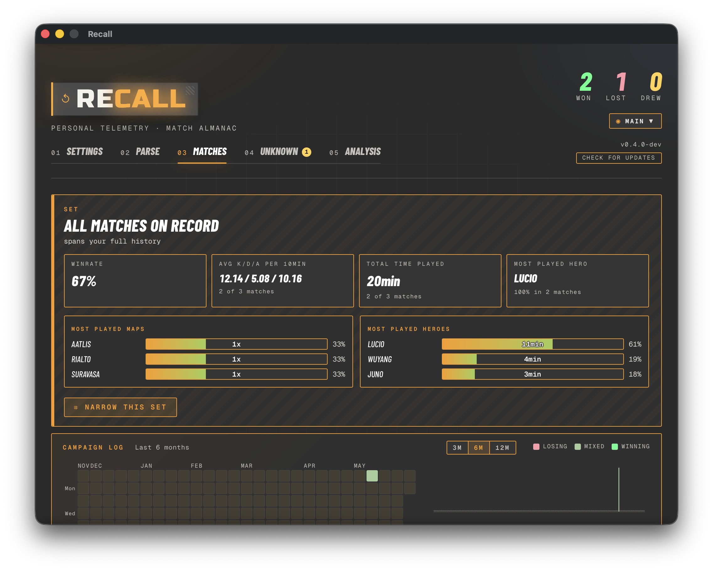
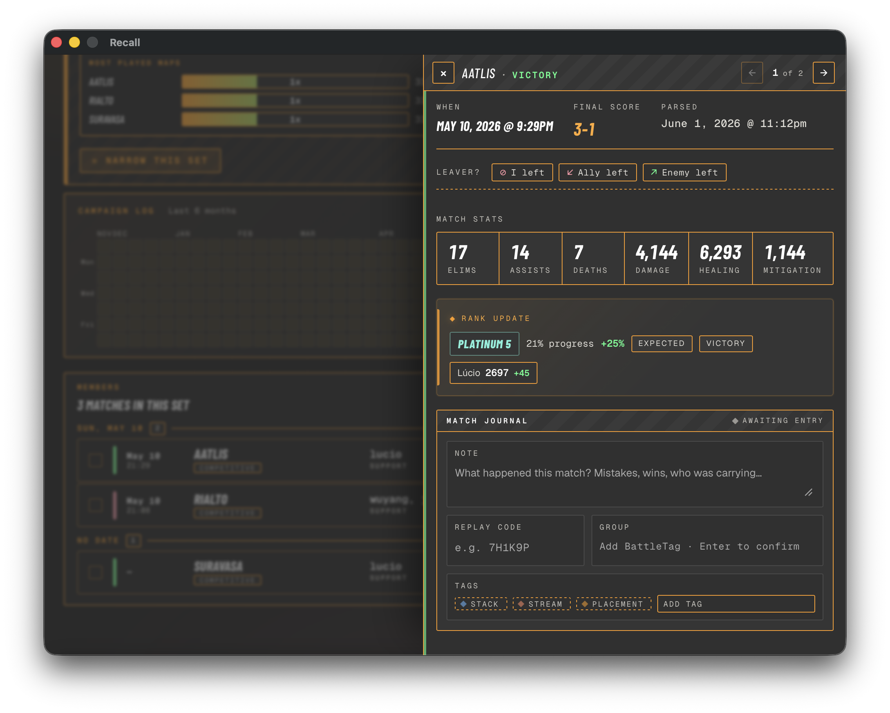

# How Recall works

Recall turns a folder of Overwatch screenshots into a personal,
filterable match history. This page walks through the pipeline so the
[Settings reference](settings-reference.md),
[Filtering guide](filtering.md), and
[Unknown screenshots](unknown-screenshots.md) chapters make sense in
context.

## What it looks like

<table>
<tr>
<th align="left">Matches view</th>
<th align="left">Match detail panel</th>
</tr>
<tr>
<td valign="top" width="50%">
<a href="screenshots/matches-view.png"></a>
<sub>The Matches tab — a customizable dossier headline (W/L/D, win rate, top maps/heroes, active-clause chips), the Campaign Log heatmap + Geography (Map × Role) band, and the compact leaf-row list below.</sub>
</td>
<td valign="top" width="50%">
<a href="screenshots/match-detail-panel.png"></a>
<sub>Clicking a row (or pressing <code>e</code>) slides in the per-match dossier — annotation, stats, rank update, heroes played, source screenshots.</sub>
</td>
</tr>
</table>

The rest of this chapter is the pipeline that fills those views.

## The pipeline in one paragraph

You play a comp match. After it ends, you tab through the post-match
screens (SUMMARY, TEAMS screen, PERSONAL tab) and press the
in-game **Print Screen** binding on each. Overwatch saves the PNG
files into your screenshots folder. Recall watches that folder, runs each
new PNG through Tesseract OCR to read the on-screen text, classifies
it by screenshot type (rank / summary / teams / personal),
extracts the fields it can (map, mode, hero, eliminations, deaths,
SR change, …), and folds 3–5 screenshots from the same match into
one match record in its local database. The Matches tab then shows
that record alongside every other match you've parsed — filterable by hero,
map, mode, win/loss, and any combination of date range or
play-time threshold.

## The four screenshot types

Recall recognises four post-match screen layouts in Overwatch 2.
You don't need to capture all four for a match to land — but more
captures = more fields populated:

| Screen | What it shows | Fields Recall extracts |
|---|---|---|
| **SUMMARY** | Match overview, top heroes, performance summary | Map, playlist, game mode (control/push/escort/…), role, primary hero, victory/defeat, final score, date, finish time, game length, performance per-10-min averages |
| **TEAMS screen** | Both teams' stats side by side | Eliminations / assists / deaths, damage, healing, mitigation |
| **PERSONAL** | One hero's detailed stat grid (3×3) | Hero-specific stats (e.g. Juno's `pulsar_torpedoes_damage`, Mizuki's `binding_chain_accuracy`) |
| **RANK** | Competitive ladder badge + per-hero SR | Rank tier + level, rank progress % (negative on a demotion screen), win/loss, match modifiers (expected / underdog / demotion protection / …), per-hero SR + change |

If you swapped heroes mid-match, Overwatch shows a separate PERSONAL
tab per hero — Recall captures each one and merges them into the
same match record. The first hero in the SUMMARY's "Heroes Played"
list becomes the match's primary hero in filters and card headers.

The PERSONAL tab also has an **"All Heroes"** sub-tab showing your
combined totals across every hero. You don't need to capture it —
those totals duplicate the TEAMS screen, and the sub-tab's stat-card
icons confuse the OCR. If you do screenshot it, Recall recognises and
quietly skips it (no re-OCR on later runs) rather than dropping it on
the Unknown tab.

### What each type looks like

Real examples from Recall's parser-regression fixture set — the same
PNG files live under `testdata/` in the repo and are the inputs
`TestParseScreenshot_GoldenFiles` runs against on every commit. Click
any image for the full-resolution source.

<table>
<tr>
<th align="left">SUMMARY</th>
<th align="left">TEAMS screen</th>
</tr>
<tr>
<td valign="top" width="50%">
<a href="testdata/Overwatch%202%20Screenshot%202026.05.24%20-%2022.36.31.03.png"></a>
<sub>Antarctic Peninsula · comp victory 2-1. The map + game mode + heroes-played list + per-10-min averages all come from this tab.</sub>
</td>
<td valign="top" width="50%">
<a href="testdata/Overwatch%202%20Screenshot%202026.05.24%20-%2022.36.33.04.png"></a>
<sub>Same match. Eliminations / assists / deaths / damage / healing / mitigation come from the highlighted row + the right-hand stat panel.</sub>
</td>
</tr>
<tr>
<th align="left" colspan="2">PERSONAL (one per hero played)</th>
</tr>
<tr>
<td valign="top" width="50%">
<a href="testdata/Overwatch%202%20Screenshot%202026.05.24%20-%2022.36.34.50.png"></a>
<sub>Juno's PERSONAL tab. The 3×3 grid populates hero-specific stats (pulsar torpedoes damage, orbital ray healing, players saved, weapon accuracy).</sub>
</td>
<td valign="top" width="50%">
<a href="testdata/Overwatch%202%20Screenshot%202026.05.24%20-%2022.36.36.31.png"></a>
<sub>Mizuki's PERSONAL tab from the same match — the player swapped from Juno (67% played) to Mizuki (33% played). Recall captures one PERSONAL per hero and merges them into the same match record.</sub>
</td>
</tr>
<tr>
<th align="left" colspan="2">RANK (competitive progress)</th>
</tr>
<tr>
<td valign="top" width="50%">
<a href="testdata/Overwatch%202%20Screenshot%202026.05.10%20-%2021.30.19.95.png"></a>
<sub>A win — Platinum 5, +21% rank progress, Lúcio SR 2697 (+45). Tier, level, progress %, modifiers (expected · victory), and per-hero SR all come from this screen.</sub>
</td>
<td valign="top" width="50%">
<a href="testdata/Overwatch%202%20Screenshot%202026.06.12%20-%2020.16.45.68.png"></a>
<sub>A loss under <strong>demotion protection</strong> — Gold 1, -19% rank progress, Lúcio SR 2733. Recall reads the negative progress and the demotion shield so a rough run still parses correctly.</sub>
</td>
</tr>
</table>

## Expected workflow

### First-time setup (about 2 minutes)

1. **Install Recall** for your OS — [macOS](install-macos.md),
   [Linux](install-linux.md), or [Windows](install-windows.md).
2. **Install Tesseract 5.x** — the OCR engine Recall shells out to.
   Each install guide has the per-platform command (Homebrew on
   macOS, apt on Linux, UB-Mannheim installer on Windows).
3. **Point Recall at your screenshots folder.** Open Recall and go
   to **Settings → Directories → Change Folder…**. The default
   Overwatch path on each OS is in the install guide.

That's it for setup. **Settings → Engine** should now show
**Detected** with a green dot and Tesseract's version.

### Day-to-day

1. **Play matches and capture post-game screens.** Bind a screenshot
   key in Overwatch (Options → Controls → Take Screenshot — most
   people use **Print Screen** or **F12**). **Capture on the post-match
   screens, not mid-game**: the post-match SUMMARY is the one that
   carries the map, result, and finish time Recall uses to pin a match
   and tell two apart, so it's the anchor everything else attaches to
   (the in-game scoreboard contributes combat stats only). See the
   [FAQ](faq.md) for why this matters. After every comp match, tab
   through SUMMARY → TEAMS → PERSONAL × however many heroes you played →
   optionally RANK, pressing the key on each.
2. **Recall picks them up.** If you've armed
   **Parse → Watch Folder** (the recommended setting), Recall
   debounces 60 seconds after the last new PNG and auto-parses the
   batch. Otherwise click **Parse → Run Parse** when you're ready.
3. **Browse the Matches tab.** Each match appears as a card with map,
   primary hero, e/a/d, and result. Click a card (or the chevron, or
   press `e` on the focused row) to open the **detail panel** — a
   slide-in surface on the right with the full readout: When · Final
   Score · Parsed, your match journal (notes / replay / squad / tags),
   the leaver chooser, the Match Stats grid, a Rank Update card (when
   a rank screenshot was captured for this match), Heroes Played, and
   the source screenshots. Use `←` / `→` to step through the filtered
   list without closing the panel; `↑` / `↓` scroll inside the panel.
   Click a source screenshot inline-preview to enlarge it fullscreen
   (× / Esc / backdrop click closes). Press `?` for the full
   keyboard cheatsheet. Use the [Filter matches panel](filtering.md)
   to slice the view by any combination of hero, map, role, result,
   date, tag, or minimum play time.
4. **Tune the workspace to taste.** The dossier's KPI + breakdown
   widgets are customizable — hover any widget for a drag-grip
   (reorder) and a × (remove), and use the **Add** menu to re-add a
   removed widget or **Reset** to the install default. The two
   full-width bands below the dossier — the **Campaign Log** win/loss
   calendar + brushable sparkline, and the **Geography** Map × Role
   heatmap — are themselves removable + reorderable sections (both on
   by default; the dossier always stays on top). The Geography band
   has its own gear to filter the heatmap down to specific roles, map
   types, or maps. See [Filtering and grouping](filtering.md) for the
   details.

### Editing and hand-entering matches

OCR isn't the only way data gets in, and it isn't always right. Two
affordances cover the gaps:

- **Edit a parsed field.** OCR occasionally misreads a damage number or
  mislabels a stat. In the detail panel, click any combat stat (Elims,
  Assists, Deaths, Damage, Healing, Mitigation) to edit it in place —
  Enter saves, Esc cancels. Your edits are kept **separate** from the
  scanned values: an edited field shows a small **✎** you can click to
  revert just that field, and the panel header gains a **Reset to OCR**
  button that discards every edit on the match. Nothing overwrites the
  original parse, so a reset always restores exactly what was scanned.
- **Add a match by hand.** No Tesseract? Click **Add match** in the
  Matches toolbar and fill in what you remember: map, competitive or
  quick play, role or open queue, the heroes you played (the first is
  your primary), the result, when it was played (defaults to now), and —
  for comp — your rank and how much it moved. Save, and the match joins
  your history like any other. The right-side panel (reviewed, replay
  code, squad, tags) works on it exactly as it does on a scanned match.

**Every match carries a source badge** so you always know where its data
came from:

- **OCR** — parsed from screenshots, untouched.
- **Edited** — parsed, then corrected by you (hover to see how many fields).
- **Manual** — hand-entered, no screenshots.

Most people are one type or the other — all-OCR or all-manual — but you
can freely mix them: edit a hand-entered match, or hand-correct a scanned
one.

### Supported capture sources

Four capture-tool filename shapes are recognised end-to-end (timestamp
extraction + correlation by per-second matching), each with auto-
detected default folders on Windows:

| Source | Example filename | Auto-detect path (Windows) |
|---|---|---|
| **Nvidia Overlay** | `Overwatch 2 Screenshot 2026.05.10 - 19.57.14.89.png` | `Videos\NVIDIA\Overwatch 2` |
| **OW default PrntScn** | `ScreenShot_26-06-07_22-59-52-000.jpg` | `Documents\Overwatch\ScreenShots\Overwatch` |
| **Windows Snip tool** | `Screenshot 2026-06-07 224855.png` | `Pictures\Screenshots` |
| **Steam in-game F12** | `20260609000031_1.jpg` | `<SteamInstall>\userdata\<id>\760\remote\<OW-app-id>\screenshots` |

On macOS / Linux the four cards are hidden and you point Recall at
whichever folder OW (or Steam, or your screenshot manager) writes to.
The filename shape — not the folder — is what the parser uses to
correlate the timestamp, so the same matcher fires regardless of
platform.

A fifth source can be added by editing
`pkg/parser/screenshot_sources.yaml` (see the file's header
comments for the regex + capture-group rules); no Go edits required.
The same YAML rides the live-data channel that pushes new heroes/maps
between Recall releases — see
[Updates & game data](settings-reference.md#updates--game-data).

### Time-series charts

The **Matches** tab has a collapsible **Trends** section that charts
your history over time — SR by hero, a selectable per-match stat
(KDA, eliminations, damage, …), a rolling win-rate, and per-10
performance. The charts honour whatever filters you've narrowed the
set to, so you can scope a trend to one hero, map, or date range.

## What Recall doesn't do

- **No upload, no account, no telemetry.** Recall is fully local.
  Screenshots stay on your disk, the database is a single SQLite
  file under your OS's user-config directory. There is no Recall
  server to phone home to.
- **No name extraction.** The parser doesn't try to read BattleTags
  off teams — only your own stats are kept. If you blur or
  crop other players' tags before sharing a screenshot, the parser
  is unaffected.
- **No real-time stream.** Recall reads PNG files that Overwatch has
  already written; it doesn't hook into the game process or read
  the game's network traffic.

## Where things live on disk

Recall keeps state in your OS's user-config directory. The
install-wide base directory:

| OS | Base directory |
|---|---|
| macOS | `~/Library/Application Support/Recall/` |
| Linux | `~/.config/recall/` (or `$XDG_CONFIG_HOME/recall/`) |
| Windows | `%AppData%\Recall\` |

Inside the base directory, Recall organises everything by
**profile**. Each profile is a separate OW account (or alt, or
any logical grouping you want) with its own settings and match
database — switching profiles via the masthead chip swaps every
data surface (dossier, heatmap, Archive) to that profile's history.

```text
<base>/
├── profiles.json        ← which profile is active + the list
└── profiles/
    ├── main/            ← the default profile (created on first launch)
    │   ├── settings.json
    │   └── db/recall.db
    └── alt/             ← any profile you create from the chip
        ├── settings.json
        └── db/recall.db
```

Inside each profile directory:

- `settings.json` — the screenshots folder, Tesseract path, theme,
  toggle states. One JSON object, human-editable if you want.
  Each profile has its own; switching profiles loads a different
  file.
- `db/recall.db` — SQLite database of every parsed match for that
  profile. Single-file; back up by copying.

Wiping a profile's `db/recall.db` (or using **Settings → Advanced
→ Clear Parse Database** while that profile is active) deletes
match history for that profile but leaves screenshots and
settings alone. Re-running Parse against the same screenshot
folder rebuilds it from scratch.

You can scope a single launch to a specific profile via
`--profile=<name>` on the binary — useful for opening an alt
account once without changing the persisted active profile.

## Next chapter

- **Configure Recall**: [Settings reference](settings-reference.md)
- **Slice your match history**: [Filtering and grouping](filtering.md)
- **Triage parse failures**: [Unknown screenshots](unknown-screenshots.md)
